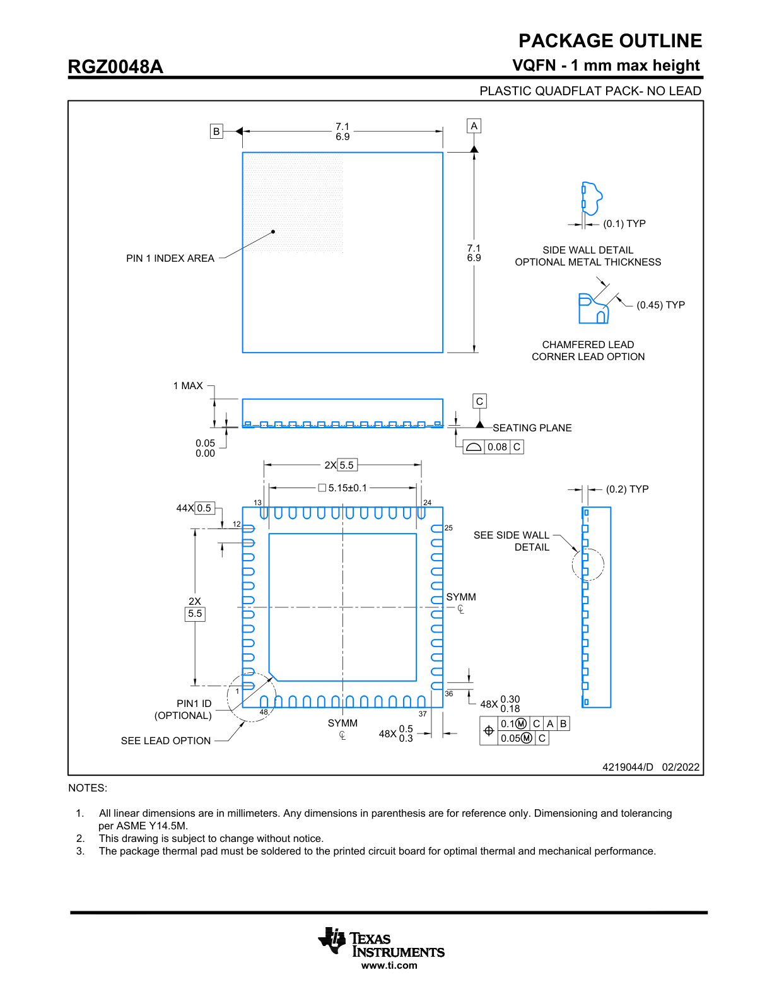

# 4219044-02_PKG_OUTLINE

## PACKAGE OUTLINE
RGZ0048A
VQFN - 1 mm max height
PLASTIC QUADFLAT PACK- NO LEAD

**Figure Description: Mechanical Drawing for RGZ0048A VQFN Package**

This technical drawing provides the package outline and dimensions for the RGZ0048A, a 48-pin VQFN (Very thin Quad Flat Pack No-Lead) plastic package. The drawing includes top, bottom, and side views, along with detailed close-ups of specific features.

**Key Views and Dimensions:**

*   **Top View:**
    *   Shows the overall body dimensions, which are square, measuring between 6.9 mm and 7.1 mm on each side.
    *   A "PIN 1 INDEX AREA" is indicated in the top left corner.

*   **Side View:**
    *   Illustrates the package height, with a maximum dimension of 1 mm.
    *   The standoff from the seating plane is between 0.00 mm and 0.05 mm.
    *   The seating plane is defined by datum C, with a coplanarity tolerance of 0.08 mm.

*   **Bottom View:**
    *   Details the 48-pin layout and the central thermal pad.
    *   **Thermal Pad:** The central exposed pad has dimensions of 5.15 ±0.1 mm.
    *   **Pin Layout:** There are 48 pins arranged symmetrically around the perimeter. Pins 1, 12, 13, 24, 25, 36, 37, and 48 are explicitly numbered.
    *   **Pin Dimensions:** Each of the 48 pins has a width between 0.18 mm and 0.30 mm.
    *   **Pin Pitch:** The pitch between the centers of the pins is 0.5 mm.
    *   **Overall Footprint:** The dimension across the package from the tips of opposing pins is 5.5 mm.
    *   **Pin 1 Indicator:** An optional PIN1 ID (chamfer) is shown in the corner near pin 1.

*   **Detailed Views:**
    *   **Side Wall Detail:** Shows a cross-section of a single lead, indicating optional metal thickness. A typical dimension of (0.1) mm is shown.
    *   **Corner Lead Option:** Provides a detailed view of a chamfered corner lead, with a typical dimension of (0.45) mm.

**Geometric Tolerancing:**
*   `0.1 M C A B`
*   `0.05 M C`

### NOTES:
1.  All linear dimensions are in millimeters. Any dimensions in parenthesis are for reference only. Dimensioning and tolerancing per ASME Y14.5M.
2.  This drawing is subject to change without notice.
3.  The package thermal pad must be soldered to the printed circuit board for optimal thermal and mechanical performance.