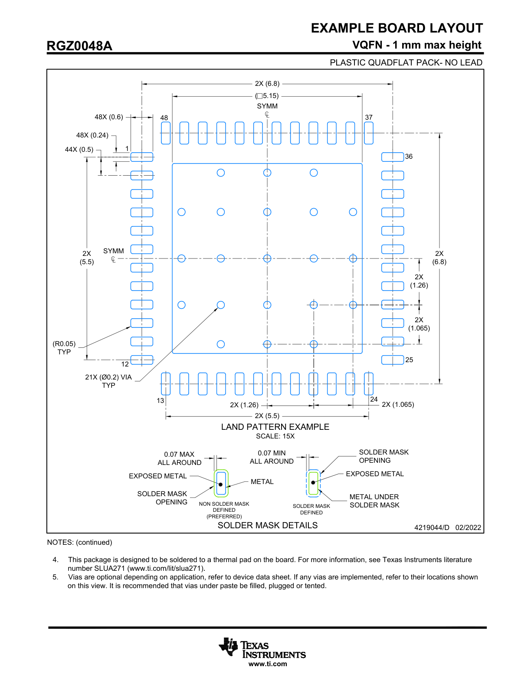

# 4219044-03_BOARD_LAYOUT

### NOTES: (continued)
4. This package is designed to be soldered to a thermal pad on the board. For more information, see Texas Instruments literature number SLUA271 ([www.ti.com/lit/slua271](http://www.ti.com/lit/slua271)).
5. Vias are optional depending on application, refer to device data sheet. If any vias are implemented, refer to their locations shown on this view. It is recommended that vias under paste be filled, plugged or tented.

## EXAMPLE BOARD LAYOUT

**RGZ0048A**
**VQFN - 1 mm max height**
**PLASTIC QUADFLAT PACK- NO LEAD**

**Figure 1: Example Board Layout for RGZ0048A Package**

This diagram provides a recommended land pattern for the RGZ0048A VQFN (Very thin Quad Flat No-lead) package. The scale of the drawing is 15X.

### Land Pattern Details

The layout shows a central thermal pad surrounded by 48 peripheral I/O pads.

*   **Peripheral Pads:**
    *   There are 48 pads in total, with 12 on each side.
    *   Pad dimensions: 0.24 mm width, 0.6 mm length (48X).
    *   Pad pitch: 0.5 mm (44X).
    *   The pads have a typical corner radius of R0.05.
    *   Pin numbering is indicated at the corners: 1, 12, 13, 24, 25, 36, 37, 48.

*   **Central Thermal Pad & Vias:**
    *   A large square thermal pad is located in the center.
    *   There are 21 thermal vias shown within the central pad area.
    *   Each via has a typical diameter of Ø0.2 mm.

### Key Dimensions (in mm)

*   **Overall Pad Array:**
    *   Overall width/height of the outer pad edges: 6.8 (2X).
    *   Overall width/height of the inner pad edges: 5.5 (2X).
    *   Center-to-center distance of corner pads: 5.15.

*   **Symmetry and Spacing:**
    *   The layout is symmetrical about the horizontal and vertical centerlines.
    *   Spacing from the centerline to the center of the side pads: 1.26 (2X).
    *   Spacing from the centerline to the center of the inner pads on the side: 1.065 (2X).

### Solder Mask Details

Two methods for defining the solder mask opening are illustrated:

*   **Non-Solder Mask Defined (NSMD) (Preferred):**
    *   The solder mask opening is larger than the metal pad.
    *   This exposes the sides of the metal pad, which is preferred for better solder joint formation.
    *   The clearance between the metal edge and the solder mask opening is 0.07 mm MAX all around.

*   **Solder Mask Defined (SMD):**
    *   The solder mask opening is smaller than the metal pad.
    *   The metal extends under the solder mask.
    *   The overlap of the metal under the solder mask is 0.07 mm MIN all around.