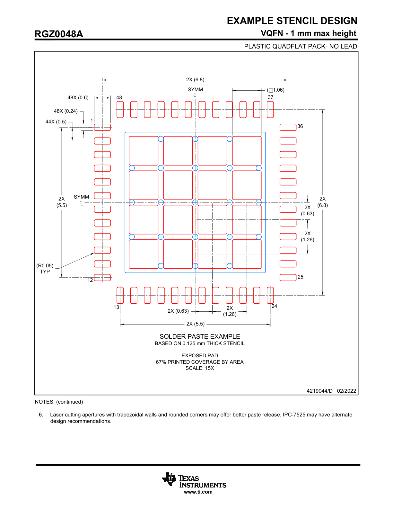

# 4219044-04_STENCIL

### NOTES: (continued)
6. Laser cutting apertures with trapezoidal walls and rounded corners may offer better paste release. IPC-7525 may have alternate design recommendations.

## EXAMPLE STENCIL DESIGN

**RGZ0048A**
**PLASTIC QUADFLAT PACK- NO LEAD**

**Figure 1: Example Stencil Design for RGZ0048A Package**

This diagram provides a solder paste example for the RGZ0048A VQFN package, based on a 0.125 mm thick stencil. The scale of the drawing is 15X.

*   **Package Type:** VQFN (Plastic Quad-Flat Pack, No-Lead) with a maximum height of 1 mm.
*   **Peripheral Pads:** There are 48 apertures for the peripheral pads, arranged in a square formation (12 on each side).
    *   **Dimensions:**
        *   Each of the 48 pads has an aperture of `0.6 mm` by `0.24 mm`.
        *   The pitch between 44 of the pads is `0.5 mm`.
        *   The corners of the apertures are rounded with a typical radius of `R0.05 mm`.
    *   **Overall Layout Dimensions:**
        *   The total span across the top and right pad rows is `6.8 mm`.
        *   The total span across the bottom and left pad rows is `5.5 mm`.
*   **Exposed Pad:** The central exposed pad has a window-pane stencil design, resulting in 67% printed coverage by area. It is divided into a 4x4 grid of square apertures.
    *   **Dimensions:**
        *   The spacing/size of the apertures is indicated by dimensions like `2X (0.63)` and `2X (1.26)`.
*   **Pin Numbering:** The diagram indicates the locations of pins 1, 12, 13, 24, 25, 36, 37, and 48 to show the orientation of the package footprint.
*   **Symmetry:** `SYMM` markings indicate that the design is symmetrical along the central horizontal and vertical axes.

*Document ID: 4219044/D, Date: 02/2022*

## IMPORTANT NOTICE AND DISCLAIMER

TI PROVIDES TECHNICAL AND RELIABILITY DATA (INCLUDING DATASHEETS), DESIGN RESOURCES (INCLUDING REFERENCE DESIGNS), APPLICATION OR OTHER DESIGN ADVICE, WEB TOOLS, SAFETY INFORMATION, AND OTHER RESOURCES “AS IS” AND WITH ALL FAULTS, AND DISCLAIMS ALL WARRANTIES, EXPRESS AND IMPLIED, INCLUDING WITHOUT LIMITATION ANY IMPLIED WARRANTIES OF MERCHANTABILITY, FITNESS FOR A PARTICULAR PURPOSE OR NON-INFRINGEMENT OF THIRD PARTY INTELLECTUAL PROPERTY RIGHTS.

These resources are intended for skilled developers designing with TI products. You are solely responsible for (1) selecting the appropriate TI products for your application, (2) designing, validating and testing your application, and (3) ensuring your application meets applicable standards, and any other safety, security, regulatory or other requirements.

These resources are subject to change without notice. TI grants you permission to use these resources only for development of an application that uses the TI products described in the resource. Other reproduction and display of these resources is prohibited. No license is granted to any other TI intellectual property right or to any third party intellectual property right. TI disclaims responsibility for, and you fully indemnify TI and its representatives against any claims, damages, costs, losses, and liabilities arising out of your use of these resources.

TI’s products are provided subject to TI’s Terms of Sale , TI’s General Quality Guidelines , or other applicable terms available either on ti.com or provided in conjunction with such TI products. TI’s provision of these resources does not expand or otherwise alter TI’s applicable warranties or warranty disclaimers for TI products. Unless TI explicitly designates a product as custom or customer-specified, TI products are standard, catalog, general purpose devices.

TI objects to and rejects any additional or different terms you may propose.

### IMPORTANT NOTICE
Copyright © 2025, Texas Instruments Incorporated
Last updated 10/2025