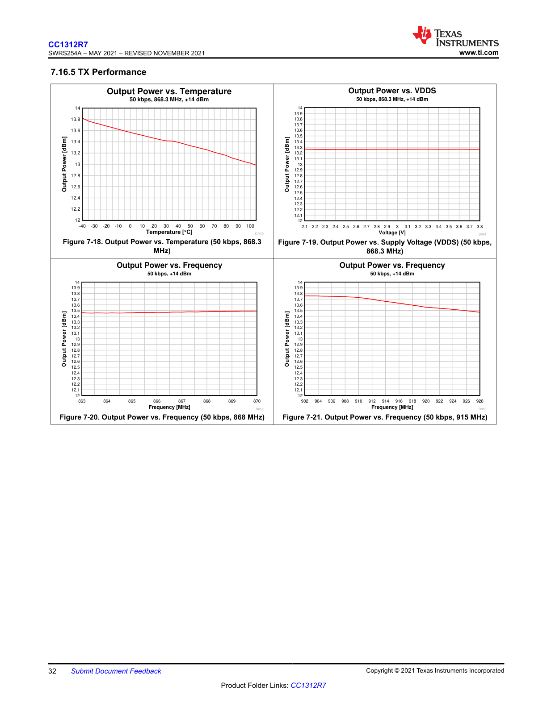

# 7.16.5 TX Performance

**Figure Descriptions:**

This image displays four graphs illustrating the transmitter (TX) performance of the CC1312R7 device under various conditions.

### Figure 7-18. Output Power vs. Temperature (50 kbps, 868.3 MHz)
This line graph shows the relationship between output power and ambient temperature.
- **X-Axis:** Temperature in degrees Celsius (°C), ranging from -40 to 100.
- **Y-Axis:** Output Power in dBm, ranging from 12 to 14.
- **Conditions:** Data rate of 50 kbps, frequency of 868.3 MHz, and a target output power of +14 dBm.
- **Trend:** The output power exhibits a near-linear decrease as temperature increases. It starts at approximately 13.8 dBm at -40°C and drops to about 13.0 dBm at 100°C.

### Figure 7-19. Output Power vs. Supply Voltage (VDDS) (50 kbps, 868.3 MHz)
This line graph illustrates the stability of the output power across a range of supply voltages.
- **X-Axis:** Supply Voltage (VDDS) in Volts (V), ranging from 2.1 to 3.8.
- **Y-Axis:** Output Power in dBm, ranging from 12 to 14.
- **Conditions:** Data rate of 50 kbps, frequency of 868.3 MHz, and a target output power of +14 dBm.
- **Trend:** The output power is very stable, remaining nearly constant at approximately 13.3 dBm across the entire tested voltage range.

### Figure 7-20. Output Power vs. Frequency (50 kbps, 868 MHz)
This line graph shows the output power variation across the 868 MHz frequency band.
- **X-Axis:** Frequency in MHz, ranging from 863 to 870.
- **Y-Axis:** Output Power in dBm, ranging from 12 to 14.
- **Conditions:** Data rate of 50 kbps and a target output power of +14 dBm.
- **Trend:** The output power is very flat across this frequency range, remaining consistent at approximately 13.5 dBm.

### Figure 7-21. Output Power vs. Frequency (50 kbps, 915 MHz)
This line graph shows the output power variation across the 915 MHz frequency band.
- **X-Axis:** Frequency in MHz, ranging from 902 to 928.
- **Y-Axis:** Output Power in dBm, ranging from 12 to 14.
- **Conditions:** Data rate of 50 kbps and a target output power of +14 dBm.
- **Trend:** The output power is highest at the lower end of the band, peaking around 13.8 dBm near 904 MHz. It then gradually rolls off to approximately 13.5 dBm at 928 MHz.