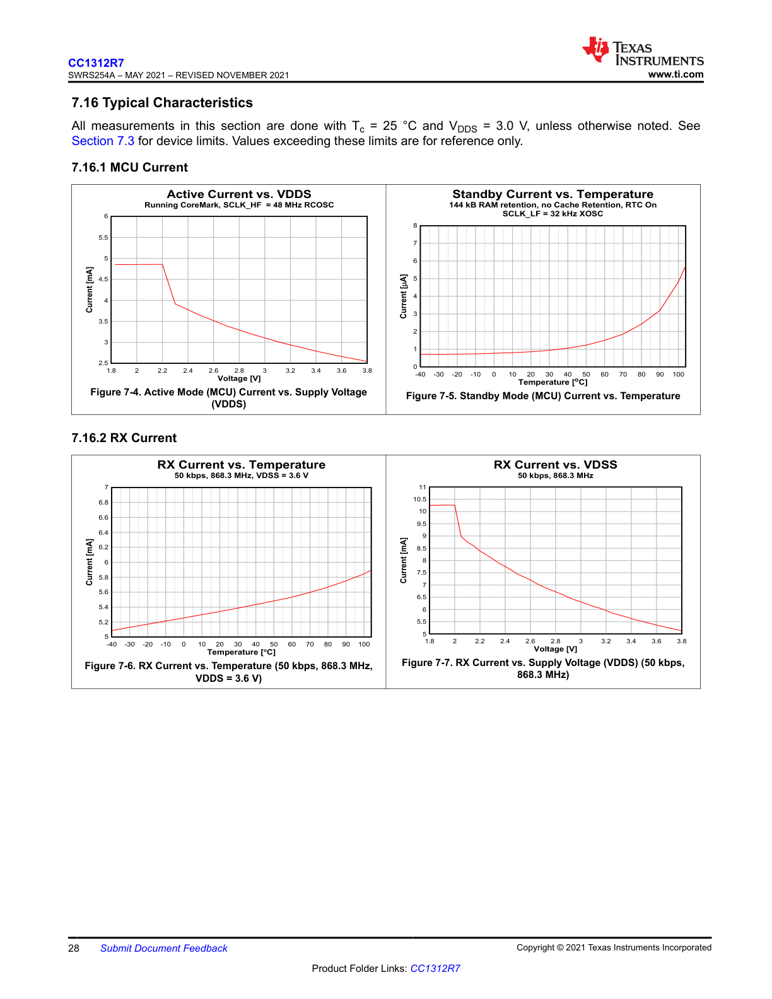

# 7.16 Typical Characteristics
All measurements in this section are done with T c = 25 °C and V DDS = 3.0 V, unless otherwise noted. See Section 7.3 for device limits. Values exceeding these limits are for reference only.

## 7.16.1 MCU Current

**Figure 7-4: Active Mode (MCU) Current vs. Supply Voltage (VDDS)**
This line graph shows the relationship between the MCU's active current consumption and the supply voltage (VDDS).
- **Title:** Active Current vs. VDDS
- **Conditions:** Running CoreMark, SCLK_HF = 48 MHz RCOSC
- **X-Axis:** Voltage [V], ranging from 1.8 V to 3.8 V.
- **Y-Axis:** Current [mA], ranging from 2.5 mA to 6.0 mA.
- **Data Trend:** The current is relatively flat at approximately 4.8 mA between 1.8 V and 2.2 V. It then drops sharply to about 4.0 mA at 2.3 V. As the voltage increases from 2.3 V to 3.8 V, the current consumption decreases steadily in a near-linear fashion, ending at approximately 2.6 mA.

**Figure 7-5: Standby Mode (MCU) Current vs. Temperature**
This line graph illustrates the MCU's standby current consumption across a range of temperatures.
- **Title:** Standby Current vs. Temperature
- **Conditions:** 144 kB RAM retention, no Cache Retention, RTC On, SCLK_LF = 32 kHz XOSC
- **X-Axis:** Temperature [°C], ranging from -40 °C to 100 °C.
- **Y-Axis:** Current [µA], ranging from 0 µA to 8 µA.
- **Data Trend:** The standby current is very low and stable, around 1 µA, for temperatures from -40 °C up to approximately 40 °C. Beyond 40 °C, the current begins to increase exponentially, reaching approximately 6 µA at 100 °C.

## 7.16.2 RX Current

**Figure 7-6: RX Current vs. Temperature (50 kbps, 868.3 MHz, VDDS = 3.6 V)**
This line graph shows the RX current consumption as a function of temperature under specific operating conditions.
- **Title:** RX Current vs. Temperature
- **Conditions:** 50 kbps, 868.3 MHz, VDDS = 3.6 V
- **X-Axis:** Temperature [°C], ranging from -40 °C to 100 °C.
- **Y-Axis:** Current [mA], ranging from 5.0 mA to 7.0 mA.
- **Data Trend:** The RX current increases gradually and almost linearly as the temperature rises. It starts at approximately 5.2 mA at -40 °C and climbs to about 5.9 mA at 100 °C.

**Figure 7-7: RX Current vs. Supply Voltage (VDDS) (50 kbps, 868.3 MHz)**
This line graph shows the RX current consumption versus the supply voltage (VDDS) at a constant data rate and frequency.
- **Title:** RX Current vs. VDSS
- **Conditions:** 50 kbps, 868.3 MHz
- **X-Axis:** Voltage [V], ranging from 1.8 V to 3.8 V.
- **Y-Axis:** Current [mA], ranging from 5.0 mA to 11.0 mA.
- **Data Trend:** The RX current is highest at lower supply voltages. It starts at about 10.5 mA at 1.8 V, drops sharply to around 9.2 mA at 2.1 V, and then decreases steadily and almost linearly to approximately 5.8 mA as the voltage increases to 3.8 V.