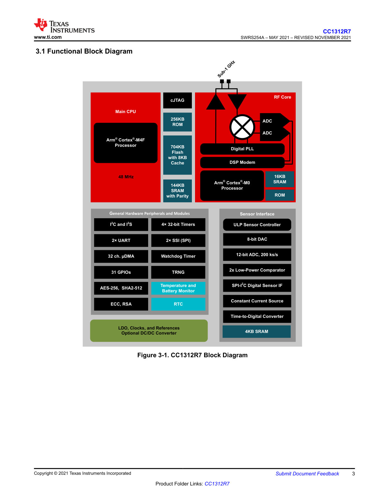
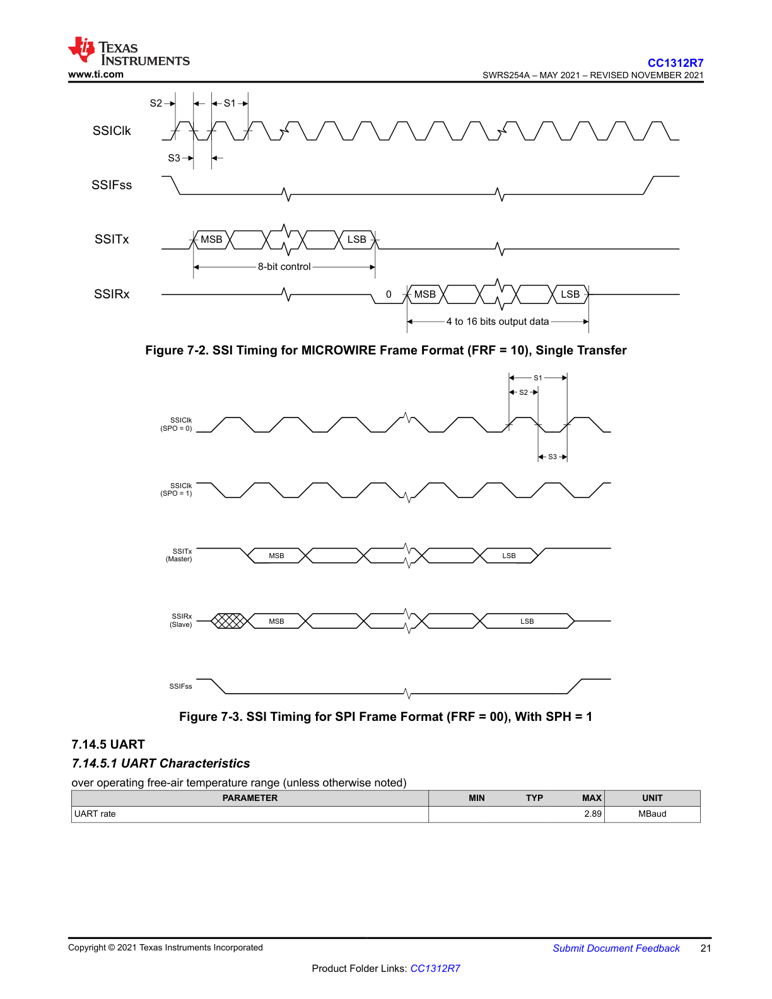
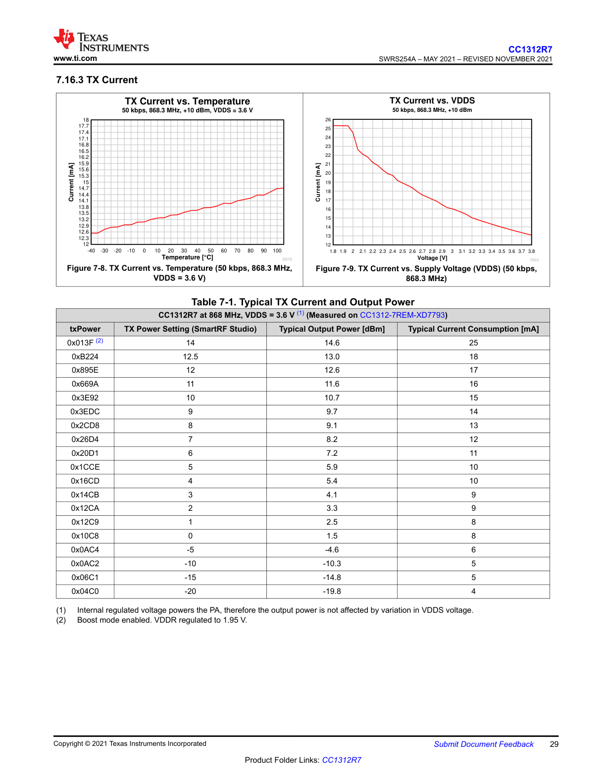
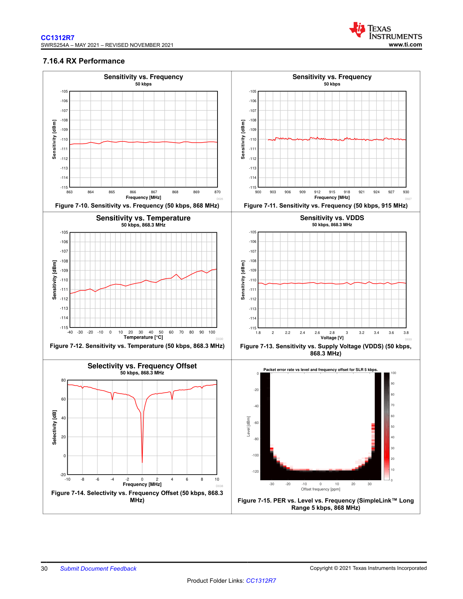
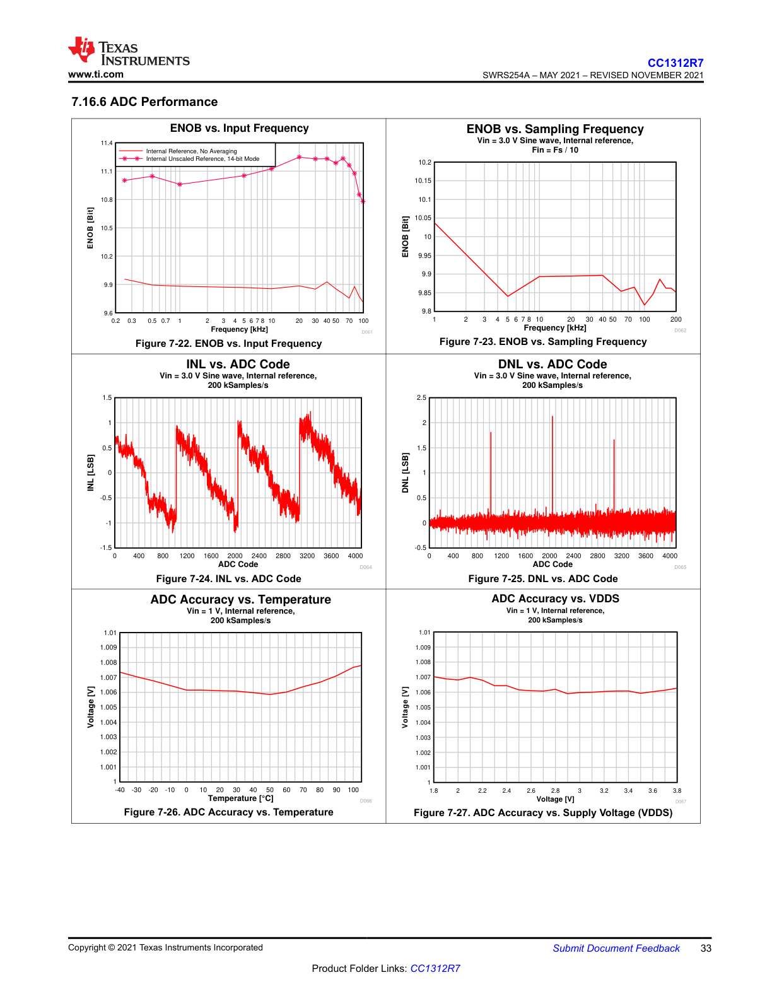
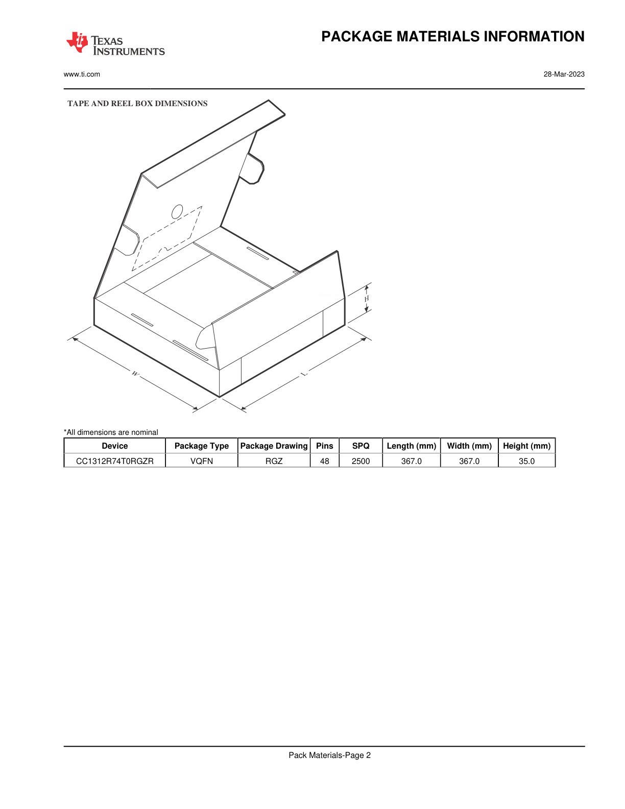

# Sheets and Views
NOTES: (continued)
6. Laser cutting apertures with trapezoidal walls and rounded corners may offer better paste release. IPC-7525 may have alternate design recommendations.

### EXAMPLE STENCIL DESIGN


**Figure Description: EXAMPLE STENCIL DESIGN RGZ0048A**

This diagram shows an example stencil design for a VQFN (Plastic Quad Flatpack - No Lead) package, specifically the RGZ0048A, with a maximum height of 1 mm. The design is based on a 0.125 mm thick stencil.

**Key Features and Dimensions:**
*   **Package Outline:** The outer pads for the 48 pins are arranged in a square pattern around a central exposed pad. The pins are numbered 1-12, 13-24, 25-36, and 37-48 around the four sides.
*   **Solder Paste Apertures:**
    *   **Peripheral Pads:** There are 48 apertures for the peripheral pins.
        *   Dimensions: 48X (0.6) and 48X (0.24).
        *   Symmetrical arrangement with dimensions 2X (6.8) along the top and bottom rows, and 2X (6.8) along the left and right rows of pads.
        *   Spacing: 44X (0.5).
    *   **Exposed Pad:** The central exposed pad has a grid of smaller square apertures for solder paste application, which results in 67% printed coverage by area. This is a common technique for solder paste reduction to prevent component tilt and excess solder. The grid consists of 16 smaller squares.
    *   Dimensions for the central pad area include 2X (5.5) on two sides.
*   **Corner Details:** The corners of the apertures are rounded with a typical radius of R0.05.
*   **Symmetry:** The design is symmetrical, as indicated by "SYMM" markings.
*   **Scale:** The drawing is scaled 15X.
*   **Additional Dimensions:** Various other dimensions are provided, such as 2X (1.06), 2X (0.63), and 2X (1.26), indicating specific feature sizes and spacings.

This stencil design is critical for ensuring proper solder paste deposition during the surface-mount technology (SMT) assembly process, which affects the quality and reliability of the solder joints.

---
### IMPORTANT NOTICE AND DISCLAIMER
TI PROVIDES TECHNICAL AND RELIABILITY DATA (INCLUDING DATASHEETS), DESIGN RESOURCES (INCLUDING REFERENCE DESIGNS), APPLICATION OR OTHER DESIGN ADVICE, WEB TOOLS, SAFETY INFORMATION, AND OTHER RESOURCES “AS IS” AND WITH ALL FAULTS, AND DISCLAIMS ALL WARRANTIES, EXPRESS AND IMPLIED, INCLUDING WITHOUT LIMITATION ANY IMPLIED WARRANTIES OF MERCHANTABILITY, FITNESS FOR A PARTICULAR PURPOSE OR NON-INFRINGEMENT OF THIRD PARTY INTELLECTUAL PROPERTY RIGHTS.

These resources are intended for skilled developers designing with TI products. You are solely responsible for (1) selecting the appropriate TI products for your application, (2) designing, validating and testing your application, and (3) ensuring your application meets applicable standards, and any other safety, security, regulatory or other requirements.

These resources are subject to change without notice. TI grants you permission to use these resources only for development of an application that uses the TI products described in the resource. Other reproduction and display of these resources is prohibited. No license is granted to any other TI intellectual property right or to any third party intellectual property right. TI disclaims responsibility for, and you fully indemnify TI and its representatives against any claims, damages, costs, losses, and liabilities arising out of your use of these resources.

TI’s products are provided subject to TI’s Terms of Sale , TI’s General Quality Guidelines , or other applicable terms available either on ti.com or provided in conjunction with such TI products. TI’s provision of these resources does not expand or otherwise alter TI’s applicable warranties or warranty disclaimers for TI products. Unless TI explicitly designates a product as custom or customer-specified, TI products are standard, catalog, general purpose devices.

TI objects to and rejects any additional or different terms you may propose.

**IMPORTANT NOTICE**
Copyright © 2025, Texas Instruments Incorporated
Last updated 10/2025

---
## CC1312R7 SimpleLink™ High-Performance Sub-1 GHz Wireless MCU

### 1 Features
*   **Wireless microcontroller**
    *   Powerful 48-MHz Arm® Cortex®-M4F processor
    *   704KB flash program memory
    *   256KB of ROM for protocols and library functions
    *   8KB of cache SRAM
    *   144KB of ultra-low leakage SRAM with parity for high-reliability operation
    *   Dynamic multiprotocol manager (DMM) driver
    *   Programmable radio includes support for 2-(G)FSK, 4-(G)FSK, MSK, OOK, IEEE 802.15.4 PHY and MAC
    *   Supports over-the-air upgrade (OTA)

*   **Ultra-low power sensor controller**
    *   Autonomous MCU with 4KB of SRAM
    *   Sample, store, and process sensor data
    *   Fast wake-up for low-power operation
    *   Software defined peripherals; capacitive touch, flow meter, LCD

*   **Low power consumption**
    *   MCU consumption:
        *   2.63 mA active mode, CoreMark
        *   55 μA/MHz running CoreMark
        *   0.8 μA standby mode, RTC, 144KB RAM
        *   0.1 μA shutdown mode, wake-up on pin
    *   Ultra low-power sensor controller consumption:
        *   25.2 μA in 2 MHz mode
        *   701 μA in 24 MHz mode
    *   Radio Consumption:
        *   5.4 mA RX at 868 MHz
        *   24.9 mA TX at +14 dBm at 868 MHz

*   **Wireless protocol support**
    *   Wi-SUN®
    *   mioty®
    *   Amazon Sidewalk
    *   Wireless M-Bus
    *   SimpleLink™ TI 15.4-stack
    *   6LoWPAN
    *   Proprietary systems

*   **High performance radio**
    *   -121 dBm for 2.5-kbps long-range mode
    *   -110 dBm at 50 kbps, 802.15.4, 868 MHz
    *   Output power up to +14 dBm with temperature compensation

*   **Regulatory compliance**
    *   Suitable for systems targeting compliance with these standards:
        *   ETSI EN 300 220 Receiver Cat. 1.5 and 2, EN 303 131, EN 303 204
        *   FCC CFR47 Part 15
        *   ARIB STD-T108

*   **MCU peripherals**
    *   Digital peripherals can be routed to any GPIO
    *   Four 32-bit or eight 16-bit general-purpose timers
    *   12-bit ADC, 200 kSamples/s, 8 channels
    *   8-bit DAC
    *   Two comparators
    *   Programmable current source
    *   Two UART, two SSI, I2C, I2S
    *   Real-time clock (RTC)
    *   Integrated temperature and battery monitor

*   **Security enablers**
    *   AES 128- and 256-bit cryptographic accelerator
    *   ECC and RSA public key hardware accelerator
    *   SHA2 Accelerator (full suite up to SHA-512)
    *   True random number generator (TRNG)

*   **Development tools and software**
    *   LP-CC1312R7 Development Kit
    *   SimpleLink™ CC13xx and CC26xx Software Development Kit (SDK)
    *   SmartRF™ Studio for simple radio configuration
    *   Sensor Controller Studio for building low-power sensing applications
    *   SysConfig system configuration tool

*   **Operating range**
    *   On-chip buck DC/DC converter
    *   1.8-V to 3.8-V single supply voltage
    *   -40 to +105°C

*   **Package**
    *   7-mm × 7-mm RGZ VQFN48 (30 GPIOs)
    *   RoHS-compliant package

---
### 2 Applications
*   **Grid infrastructure**
    *   Smart Meters – electricity meter, water meter, gas meter, and heat cost allocator
    *   Grid communications – wireless communications
    *   EV charging infrastructure – AC charging (pile) station
    *   Other alternative energy – energy harvesting
*   **Building automation**
    *   Building security systems – motion detector, door and window sensor, glass break detector, panic button, electronic smart lock and IP network camera
    *   HVAC systems – thermostat, environmental sensor and HVAC controller
    *   Fire safety – smoke and head detector, gas detector and fire alarm control panel
*   **Retail Automation**
    *   Retail automation & payment applications – electronic shelf labels and portable POS terminal
*   **Personal Electronics**
    *   RF remote controls
    *   Smart Speakers and Smart Displays
    *   Gaming and electronic and robotic toys
    *   Wearables (non-medical) and smart trackers
*   **Wireless Modules**
    *   Wireless third party modules including Wi-SUN®, Amazon Sidewalk, mioty® and multi-protocol
    *   Wireless communications modules

### 3 Description
The SimpleLink™ CC1312R7 device is a multiprotocol Sub-1 GHz wireless microcontroller (MCU) supporting IEEE 802.15.4g, IPv6-enabled smart objects (6LoWPAN), mioty®, Wi-SUN®, proprietary systems, including the TI 15.4-Stack (Sub-1 GHz), and concurrent multiprotocol through a Dynamic Multiprotocol Manager (DMM) driver. The CC1312R7 is based on an Arm® Cortex® M4F main processor and optimized for low-power wireless communication and advanced sensing in grid infrastructure, building automation, retail automation, personal electronics and medical applications.

The CC1312R7 has a software defined radio powered by an Arm® Cortex® M0, which allows support for multiple physical layers and RF standards. The device supports operation in 287 to 351-MHz, 359 to 527-MHz, 861 to 1054-MHz, and 1076 to 1315-MHz frequency bands. PHY and frequency band switching can be done runtime through a dynamic multiprotocol manager (DMM) driver. The CC1312R7 has an efficient built-in PA that supports +14 dBm TX at 24.9 mA current consumption. In RX it has -121 dBm sensitivity and 88 dB blocking ±10 MHz in SimpleLink™ long-range mode with 2.5-kbps data rate.

The CC1312R7 has a low sleep current of 0.9 μA with RTC and 144KB RAM retention. In addition to the main Cortex® M4F processor, the device also has an autonomous ultra-low power Sensor Controller CPU with fast wake-up capability. As an example, the sensor controller is capable of 1-Hz ADC sampling at 1-μA system current.

The CC1312R7 has Low SER (Soft Error Rate) FIT (Failure-in-time) for long operational lifetime. Always-on SRAM parity minimizes risk for corruption due to potential radiation events. Consistent with many customers’ 10 to 15 years or longer life cycle requirements, TI has a product life cycle policy with a commitment to product longevity and continuity of supply.

The CC1312R7 device is part of the SimpleLink™ MCU platform, which consists of Wi-Fi®, Bluetooth® Low Energy, Thread, Zigbee, Wi-SUN®, Amazon Sidewalk, mioty®, Sub-1 GHz MCUs, and host MCUs. CC1312R7 is part of a scalable portfolio with flash sizes from 32KB to 704KB with pin-to-pin compatible package options. The common SimpleLink™CC13xx and CC26xx Software Development Kit (SDK) and SysConfig system configuration tool supports migration between devices in the portfolio. A comprehensive number of software stacks, application examples and SimpleLink™ Academy training sessions are included in the SDK. For more information, visit wireless connectivity.

#### Device Information
| PART NUMBER (1)   | PACKAGE    | BODY SIZE (NOM)    |
|-------------------|------------|--------------------|
| CC1312R74T0RGZR   | VQFN (48)  | 7.00 mm × 7.00 mm  |

(1) For the most current part, package, and ordering information for all available devices, see the Package Option Addendum in Section 11, or see the TI website.

---
### 3.1 Functional Block Diagram





**Figure 3-1: CC1312R7 Block Diagram**

This block diagram illustrates the internal architecture of the CC1312R7 wireless MCU. It is divided into several main functional blocks, showing the CPUs, memories, radio, peripherals, and power management units.

*   **Main CPU:**
    *   **Arm® Cortex®-M4F Processor:** The primary application processor running at 48 MHz.
    *   **Memories:**
        *   704KB Flash with 8KB Cache.
        *   144KB SRAM with Parity.
        *   256KB ROM.
    *   **cJTAG:** Debug interface.
    *   Connected to general hardware peripherals and modules.

*   **RF Core:**
    *   **Arm® Cortex®-M0 Processor:** A dedicated processor to manage the radio hardware.
    *   **Memories:** 16KB SRAM and ROM.
    *   **Radio Hardware:**
        *   DSP Modem.
        *   Digital PLL.
        *   ADC.
        *   Sub-1 GHz RF front-end, connected to an external antenna.

*   **ULP Sensor Controller (and Sensor Interface):**
    *   An autonomous, ultra-low power processor for sensor management.
    *   **Memories:** 4KB SRAM.
    *   **Peripherals:**
        *   Low-Power Comparator (x2).
        *   12-bit ADC, 200 ks/s.
        *   8-bit DAC.
        *   Constant Current Source.
        *   SPI-I2C Digital Sensor IF.
        *   Time-to-Digital Converter.

*   **General Hardware Peripherals and Modules:**
    *   **Timers:** 4x 32-bit Timers.
    *   **Serial Interfaces:** 2x UART, 2x SSI (SPI), I2C, and I2S.
    *   **System/Misc:** Watchdog Timer, RTC, 32 ch. µDMA, 31 GPIOs.
    *   **Security:** AES-256, SHA2-512, ECC, RSA, TRNG.
    *   **Monitoring:** Temperature and Battery Monitor.

*   **Power and Clock Management:**
    *   LDO, Clocks, and References.
    *   Optional DC/DC Converter.

The diagram shows the major data and control pathways between these blocks, highlighting the dual-processor architecture (Cortex-M4F for application, Cortex-M0 for radio) and the dedicated sensor controller, which together enable a flexible and power-efficient system design.

---
### 4 Revision History
NOTE: Page numbers for previous revisions may differ from page numbers in the current version.

| DATE | REVISION | NOTES |
|---|---|---|
| November 2021 | * | Initial Release |

---
### 5 Device Comparison

| DEVICE | RADIO SUPPORT | FLASH (KB) | RAM (KB) | GPIO | PACKAGE SIZE |
|---|---|---|---|---|---|
| CC1310 | Sub-1 GHz<br>Wireless M-Bus | 32-128 | 16-20 | 10-30 | RGZ (7-mm × 7-mm VQFN48)<br>RHB (5 mm × 5 mm VQFN32)<br>RSM (4 mm × 4 mm VQFN32) |
| CC1312R | Sub-1 GHz<br>Wi-SUN®<br>Amazon Sidewalk<br>Wireless M-Bus | 352-704 | 80-144 | 30 | RGZ (7-mm × 7-mm VQFN48) |
| CC1352P | Multiprotocol<br>Sub-1 GHz<br>Wi-SUN®<br>Amazon Sidewalk<br>Wireless M-Bus<br>Bluetooth 5.2 Low Energy<br>Zigbee<br>Thread<br>2.4 GHz proprietary FSK-based formats<br>+20-dBm high-power amplifier | 352-704 | 80-144 | 26 | RGZ (7-mm × 7-mm VQFN48) |
| CC1352R | Multiprotocol<br>Sub-1 GHz<br>Wi-SUN®<br>Wireless M-Bus<br>Bluetooth 5.2 Low Energy<br>Zigbee<br>Thread<br>2.4 GHz proprietary FSK-based formats | 352 | 80 | 28 | RGZ (7-mm × 7-mm VQFN48) |
| CC2642R | Bluetooth 5.2 Low Energy<br>2.4 GHz proprietary FSK-based formats | 352 | 80 | 31 | RGZ (7-mm × 7-mm VQFN48) |
| CC2642R-Q1 | Bluetooth 5.2 Low Energy | 352 | 80 | 31 | RTC (7-mm × 7-mm VQFN48) |
| CC2652R | Multiprotocol<br>Bluetooth 5.2 Low Energy<br>Zigbee<br>Thread<br>2.4 GHz proprietary FSK-based formats | 352-704 | 80-144 | 31 | RGZ (7-mm × 7-mm VQFN48) |
| CC2652RB | Multiprotocol<br>Bluetooth 5.2 Low Energy<br>Zigbee<br>Thread | 352 | 80 | 31 | RGZ (7-mm × 7-mm VQFN48) |
| CC2652P | Multiprotocol<br>Bluetooth 5.2 Low Energy<br>Zigbee<br>Thread<br>2.4 GHz proprietary FSK-based formats<br>+19.5-dBm high-power amplifier | 352-704 | 80-144 | 26 | RGZ (7-mm × 7-mm VQFN48) |

---
### 6 Terminal Configuration and Functions

#### 6.1 Pin Diagram – RGZ Package (Top View)


**Figure 6-1: RGZ (7-mm × 7-mm) Pinout (Top View)**

This diagram shows the top view of the 48-pin VQFN RGZ package for the CC1312R7 device. The pins are numbered counter-clockwise from the top-left corner.

*   **Pin Numbering:**
    *   Pins 1-12 are on the top side (left to right).
    *   Pins 13-24 are on the right side (top to bottom).
    *   Pins 25-36 are on the bottom side (right to left).
    *   Pins 37-48 are on the left side (bottom to top).
*   **Pin Functions (selected):**
    *   **RF:** RF_P (Pin 1), RF_N (Pin 2), RX_TX (Pin 5)
    *   **Crystals:** X32K_Q1 (Pin 3), X32K_Q2 (Pin 4), X48M_N (Pin 46), X48M_P (Pin 47)
    *   **Power:** VDDS (Pins 13, 22, 34, 44), VDDR (Pin 45), VDDR_RF (Pin 48), DCDC_SW (Pin 33), DCOUPL (Pin 23)
    *   **Debug:** JTAG_TMSC (Pin 24), JTAG_TCKC (Pin 25)
    *   **Control:** RESET_N (Pin 35)
    *   **GPIOs (DIO):** Numerous DIO pins are distributed around the package, such as DIO_1 to DIO_30.

The following I/O pins marked in Figure 6-1 in **bold** have high-drive capabilities:
*   Pin 10, DIO_5
*   Pin 11, DIO_6
*   Pin 12, DIO_7
*   Pin 24, JTAG_TMSC
*   Pin 26, DIO_16
*   Pin 27, DIO_17

The following I/O pins marked in Figure 6-1 in *italics* have analog capabilities:
*   Pin 36, DIO_23
*   Pin 37, DIO_24
*   Pin 38, DIO_25
*   Pin 39, DIO_26
*   Pin 40, DIO_27
*   Pin 41, DIO_28
*   Pin 42, DIO_29
*   Pin 43, DIO_30

---
### 6.2 Signal Descriptions – RGZ Package

| NAME | PIN NO. | I/O | TYPE | DESCRIPTION |
|---|---|---|---|---|
| DCDC_SW | 33 | — | Power | Output from internal DC/DC converter (1) |
| DCOUPL | 23 | — | Power | For decoupling of internal 1.27 V regulated digital-supply (2) |
| DIO_1 | 6 | I/O | Digital | GPIO |
| DIO_2 | 7 | I/O | Digital | GPIO |
| DIO_3 | 8 | I/O | Digital | GPIO |
| DIO_4 | 9 | I/O | Digital | GPIO |
| DIO_5 | 10 | I/O | Digital | GPIO, high-drive capability |
| DIO_6 | 11 | I/O | Digital | GPIO, high-drive capability |
| DIO_7 | 12 | I/O | Digital | GPIO, high-drive capability |
| DIO_8 | 14 | I/O | Digital | GPIO |
| DIO_9 | 15 | I/O | Digital | GPIO |
| DIO_10 | 16 | I/O | Digital | GPIO |
| DIO_11 | 17 | I/O | Digital | GPIO |
| DIO_12 | 18 | I/O | Digital | GPIO |
| DIO_13 | 19 | I/O | Digital | GPIO |
| DIO_14 | 20 | I/O | Digital | GPIO |
| DIO_15 | 21 | I/O | Digital | GPIO |
| DIO_16 | 26 | I/O | Digital | GPIO, JTAG_TDO, high-drive capability |
| DIO_17 | 27 | I/O | Digital | GPIO, JTAG_TDI, high-drive capability |
| DIO_18 | 28 | I/O | Digital | GPIO |
| DIO_19 | 29 | I/O | Digital | GPIO |
| DIO_20 | 30 | I/O | Digital | GPIO |
| DIO_21 | 31 | I/O | Digital | GPIO |
| DIO_22 | 32 | I/O | Digital | GPIO |
| DIO_23 | 36 | I/O | Digital or Analog | GPIO, analog capability |
| DIO_24 | 37 | I/O | Digital or Analog | GPIO, analog capability |
| DIO_25 | 38 | I/O | Digital or Analog | GPIO, analog capability |
| DIO_26 | 39 | I/O | Digital or Analog | GPIO, analog capability |
| DIO_27 | 40 | I/O | Digital or Analog | GPIO, analog capability |
| DIO_28 | 41 | I/O | Digital or Analog | GPIO, analog capability |
| DIO_29 | 42 | I/O | Digital or Analog | GPIO, analog capability |
| DIO_30 | 43 | I/O | Digital or Analog | GPIO, analog capability |
| EGP | — | — | GND | Ground – exposed ground pad (3) |
| JTAG_TMSC | 24 | I/O | Digital | JTAG TMSC, high-drive capability |
| JTAG_TCKC | 25 | I | Digital | JTAG TCKC |
| RESET_N | 35 | I | Digital | Reset, active low. No internal pullup resistor |
| RF_P | 1 | — | RF | Positive RF input signal to LNA during RX<br>Positive RF output signal from PA during TX |
| RF_N | 2 | — | RF | Negative RF input signal to LNA during RX<br>Negative RF output signal from PA during TX |
| RX_TX | 3 | — | RF | Optional bias pin for the RF LNA |
| VDDR | 45 | — | Power | Internal supply, must be powered from the internal DC/DC converter or the internal LDO (2) (4) (6) |
| VDDR_RF | 48 | — | Power | Internal supply, must be powered from the internal DC/DC converter or the internal LDO (2) (5) (6) |
| VDDS | 44 | — | Power | 1.8-V to 3.8-V main chip supply (1) |
| VDDS2 | 13 | — | Power | 1.8-V to 3.8-V DIO supply (1) |
| VDDS3 | 22 | — | Power | 1.8-V to 3.8-V DIO supply (1) |
| VDDS_DCDC | 34 | — | Power | 1.8-V to 3.8-V DC/DC converter supply |
| X48M_N | 46 | — | Analog | 48-MHz crystal oscillator pin 1 |
| X48M_P | 47 | — | Analog | 48-MHz crystal oscillator pin 2 |
| X32K_Q1 | 4 | — | Analog | 32-kHz crystal oscillator pin 1 |
| X32K_Q2 | 5 | — | Analog | 32-kHz crystal oscillator pin 2 |

(1) For more details, see technical reference manual listed in Section 10.3.
(2) Do not supply external circuitry from this pin.
(3) EGP is the only ground connection for the device. Good electrical connection to device ground on printed circuit board (PCB) is imperative for proper device operation.
(4) If internal DC/DC converter is not used, this pin is supplied internally from the main LDO.
(5) If internal DC/DC converter is not used, this pin must be connected to VDDR for supply from the main LDO.
(6) Output from internal DC/DC and LDO is trimmed to 1.68 V.

### 6.3 Connections for Unused Pins and Modules

| FUNCTION | SIGNAL NAME | PIN NUMBER | ACCEPTABLE PRACTICE (1) | PREFERRED PRACTICE (1) |
|---|---|---|---|---|
| GPIO | DIO_n | 6–12, 14–21, 26–32, 36–43 | NC or GND | NC |
| 32.768-kHz crystal | X32K_Q1 | 4 | NC or GND | NC |
| | X32K_Q2 | 5 | | |
| DC/DC converter (2) | DCDC_SW | 33 | NC | NC |
| | VDDS_DCDC | 34 | VDDS | VDDS |

(1) NC = No connect
(2) When the DC/DC converter is not used, the inductor between DCDC_SW and VDDR can be removed. VDDR and VDDR_RF must still be connected and the 22 uF DCDC capacitor must be kept on the VDDR net.

---
### 7 Specifications

#### 7.1 Absolute Maximum Ratings
over operating free-air temperature range (unless otherwise noted) (1) (2)

| | MIN | MAX | UNIT |
|---|---|---|---|
| VDDS (3) Supply voltage | –0.3 | 4.1 | V |
| Voltage on any digital pin (4) | –0.3 | VDDS + 0.3, max 4.1 | V |
| Voltage on crystal oscillator pins, X32K_Q1, X32K_Q2, X48M_N and X48M_P | –0.3 | VDDR + 0.3, max 2.25 | V |
| V in Voltage on ADC input | | | |
| Voltage scaling enabled | –0.3 | VDDS | V |
| Voltage scaling disabled, internal reference | –0.3 | 1.49 | |
| Voltage scaling disabled, VDDS as reference | –0.3 | VDDS / 2.9 | |
| Input level, RF pins (RF_P and RF_N) | | 10 | dBm |
| T stg Storage temperature | –40 | 150 | °C |

(1) Stresses beyond those listed under Absolute Maximum Ratings may cause permanent damage to the device. These are stress ratings only, and functional operation of the device at these or any other conditions beyond those indicated under Recommended Operating Conditions is not implied. Exposure to absolute-maximum-rated conditions for extended periods may affect device reliability.
(2) All voltage values are with respect to ground, unless otherwise noted.
(3) VDDS_DCDC, VDDS2 and VDDS3 must be at the same potential as VDDS.
(4) Including analog capable DIOs.

#### 7.2 ESD Ratings

| | VALUE | UNIT |
|---|---|---|
| V ESD Electrostatic discharge | | |
| Human body model (HBM), per ANSI/ESDA/JEDEC JS-001 (1) All pins | ±2000 | V |
| Charged device model (CDM), per ANSI/ESDA/JEDEC JS-002 (2) All pins | ±500 | V |

(1) JEDEC document JEP155 states that 500-V HBM allows safe manufacturing with a standard ESD control process
(2) JEDEC document JEP157 states that 250-V CDM allows safe manufacturing with a standard ESD control process

#### 7.3 Recommended Operating Conditions
over operating free-air temperature range (unless otherwise noted)

| | MIN | MAX | UNIT |
|---|---|---|---|
| Operating ambient temperature (1) (3) | –40 | 105 | °C |
| Operating junction temperature (1) (3) | –40 | 115 | °C |
| Operating supply voltage (VDDS) | 1.8 | 3.8 | V |
| Operating supply voltage (VDDS), boost mode<br>VDDR = 1.95 V<br>+14 dBm RF output power | 2.1 | 3.8 | V |
| Rising supply voltage slew rate | 0 | 100 | mV/µs |
| Falling supply voltage slew rate (2) | 0 | 20 | mV/µs |

(1) Operation at or near maximum operating temperature for extended durations will result in a reduction in lifetime.
(2) For small coin-cell batteries, with high worst-case end-of-life equivalent source resistance, a 22-µF VDDS input capacitor must be used to ensure compliance with this slew rate.
(3) For thermal resistance characteristics refer to Section 7.8.

---
#### 7.4 Power Supply and Modules
over operating free-air temperature range (unless otherwise noted)

| PARAMETER | MIN | TYP | MAX | UNIT |
|---|---|---|---|---|
| VDDS Power-on-Reset (POR) threshold | 1.1 - 1.55 | | | V |
| VDDS Brown-out Detector (BOD) (1)<br>Rising threshold | | 1.77 | | V |
| VDDS Brown-out Detector (BOD), before initial boot (2)<br>Rising threshold | | 1.70 | | V |
| VDDS Brown-out Detector (BOD) (1)<br>Falling threshold | | 1.75 | | V |

(1) For boost mode (VDDR =1.95 V), TI drivers software initialization will trim VDDS BOD limits to maximum (approximately 2.0 V)
(2) Brown-out Detector is trimmed at initial boot, value is kept until device is reset by a POR reset or the RESET_N pin

#### 7.5 Power Consumption - Power Modes
When measured on the CC1312-R7EM-XD7793 reference design with T c = 25 °C, V DDS = 3.6 V with DC/DC enabled unless otherwise noted.

| PARAMETER | TEST CONDITIONS | TYP | UNIT |
|---|---|---|---|
| **Core Current Consumption** | | | |
| I core Reset and Shutdown | Reset. RESET_N pin asserted or VDDS below power-on-reset threshold | 110 | nA |
| | Shutdown. No clocks running, no retention | 110 | |
| | Standby without cache retention | RTC running, CPU, 144KB RAM and (partial) register retention.<br>RCOSC_LF | 0.8 | µA |
| | | RTC running, CPU, 64KB RAM and (partial) register retention.<br>RCOSC_LF | 0.7 | µA |
| | | RTC running, CPU, 144KB RAM and (partial) register retention<br>XOSC_LF | 0.9 | µA |
| | Standby with cache retention | RTC running, CPU, 144KB RAM and (partial) register retention.<br>RCOSC_LF | 1.9 | µA |
| | | RTC running, CPU, 144KB RAM and (partial) register retention.<br>XOSC_LF | 2.0 | µA |
| | Idle | Supply Systems and RAM powered<br>RCOSC_HF | 590 | µA |
| | Active | MCU running CoreMark at 48 MHz<br>RCOSC_HF | 2.63 | mA |
| **Peripheral Current Consumption** | | | |
| I peri Peripheral power domain | Delta current with domain enabled | 39 | µA |
| | Serial power domain | Delta current with domain enabled | 2.6 | |
| | RF Core | Delta current with power domain enabled,<br>clock enabled, RF core idle | 89 | |
| | µDMA | Delta current with clock enabled, module is idle | 57 | |
| | Timers | Delta current with clock enabled, module is idle (3) | 97 | |
| | I2C | Delta current with clock enabled, module is idle | 9.2 | |
| | I2S | Delta current with clock enabled, module is idle | 22 | |
| | SSI | Delta current with clock enabled, module is idle (2) | 50 | |
| | UART | Delta current with clock enabled, module is idle (1) | 110 | |
| | CRYPTO (AES) | Delta current with clock enabled, module is idle | 16 | |
| | PKA | Delta current with clock enabled, module is idle | 59 | |
| | TRNG | Delta current with clock enabled, module is idle | 20 | |
| **Sensor Controller Engine Consumption** | | | |
| I SCE Active mode | 24 MHz, infinite loop | 701 | µA |
| | Low-power mode | 2 MHz, infinite loop | 25.2 | |

(1) Only one UART running
(2) Only one SSI running
(3) Only one GPTimer running

---
#### 7.6 Power Consumption - Radio Modes
When measured on the CC1312-R7EM-XD7793 reference design with T c = 25 °C, V DDS = 3.6 V with DC/DC enabled unless otherwise noted.
Using boost mode (increasing VDDR up to 1.95 V), will increase system current by 15% (does not apply to TX +14 dBm setting where this current is already included).
Relevant I core and I peri currents are included in below numbers.

| PARAMETER | TEST CONDITIONS | TYP | UNIT |
|---|---|---|---|
| Radio receive current, 868 MHz | | 5.4 | mA |
| Radio transmit current | 0 dBm output power setting | | |
| | 868 MHz | 8.0 | mA |
| | +10 dBm output power setting | | |
| | 868 MHz | 14.3 | mA |
| Radio transmit current | Boost mode | | |
| | +14 dBm output power setting | | |
| | 868 MHz | 24.9 | mA |

#### 7.7 Nonvolatile (Flash) Memory Characteristics
Over operating free-air temperature range and V DDS = 3.0 V (unless otherwise noted)

| PARAMETER | TEST CONDITIONS | MIN | TYP | MAX | UNIT |
|---|---|---|---|---|---|
| Flash sector size | | 8 | | | KB |
| Supported flash erase cycles before failure, single-bank (1) (5) | | 30 | | | k Cycles |
| Supported flash erase cycles before failure, single sector (2) | | 60 | | | k Cycles |
| Maximum number of write operations per row before sector erase (3) | | | 83 | | Write Operations |
| Flash retention | 105 °C | | 11.4 | | Years at 105 °C |
| Flash sector erase current | Average delta current | | 9.5 | | mA |
| Flash sector erase time (4) | Zero cycles | | 10 | | ms |
| | 30k cycles | | 4000 | | ms |
| Flash write current | Average delta current, 4 bytes at a time | | 5.2 | | mA |
| Flash write time (4) | 4 bytes at a time | | 21.6 | | µs |

(1) A full bank erase is counted as a single erase cycle on each sector. If both flash banks are always cycled simultaneously they can be cycled 30K times each. Alternatively, the banks can be cycled a total of 30K times, e.g. the main bank X times and the second bank Y times (X+Y=30K)
(2) Up to 4 customer-designated sectors can be individually erased an additional 30k times beyond the baseline bank limitation of 30k cycles
(3) Each wordline is 2048 bits (or 256 bytes) wide. This limitation corresponds to sequential memory writes of 4 (3.1) bytes minimum per write over a whole wordline. If additional writes to the same wordline are required, a sector erase is required once the maximum number of write operations per row is reached.
(4) This number is dependent on Flash aging and increases over time and erase cycles
(5) Aborting flash during erase or program modes is not a safe operation.

#### 7.8 Thermal Resistance Characteristics

| THERMAL METRIC (1) | PACKAGE | UNIT |
|---|---|---|
| | RGZ (VQFN) 48 PINS | |
| R θJA Junction-to-ambient thermal resistance | 23.7 | °C/W (2) |
| R θJC(top) Junction-to-case (top) thermal resistance | 13.0 | °C/W (2) |
| R θJB Junction-to-board thermal resistance | 7.7 | °C/W (2) |
| ψ JT Junction-to-top characterization parameter | 0.1 | °C/W (2) |
| ψ JB Junction-to-board characterization parameter | 7.6 | °C/W (2) |
| R θJC(bot) Junction-to-case (bottom) thermal resistance | 1.9 | °C/W (2) |

(1) For more information about traditional and new thermal metrics, see Semiconductor and IC Package Thermal Metrics.
(2) °C/W = degrees Celsius per watt.

#### 7.9 RF Frequency Bands
Over operating free-air temperature range (unless otherwise noted).

| PARAMETER | MIN | TYP | MAX | UNIT |
|---|---|---|---|---|
| Frequency bands | 1076 | | 1315 | MHz |
| | 861 | | 1054 | |
| | 431 | | 527 | |
| | 359 | | 439 | |
| | 287 | | 351 | |

---
#### 7.10 861 MHz to 1054 MHz - Receive (RX)
When Measured on the CC1312-R7EM-XD7793 reference design with T c = 25 °C, V DDS = 3.0 V with DC/DC enabled unless otherwise noted. All measurements are performed at the antenna input with a combined RX and TX path. All measurements are performed conducted.

| PARAMETER | TEST CONDITIONS | MIN | TYP | MAX | UNIT |
|---|---|---|---|---|---|
| **General Parameters** | | | | | |
| Digital channel filter programmable receive bandwidth | | 4 | | 4000 | kHz |
| Data rate step size | | | 1.5 | | bps |
| Spurious emissions 25 MHz to 1 GHz | 868 MHz<br>Conducted emissions measured according to ETSI EN 300 220 | | < -57 | | dBm |
| Spurious emissions 1 GHz to 13 GHz | | | < -47 | | dBm |
| **802.15.4, 50 kbps, ±25 kHz deviation, 2-GFSK, 100 kHz RX Bandwidth** | | | | | |
| Sensitivity | BER = 10–2, 868 MHz | | –110 | | dBm |
| Saturation limit | BER = 10–2, 868 MHz | | 10 | | dBm |
| Selectivity, ±200 kHz | BER = 10–2, 868 MHz (1) | | 44 | | dB |
| Selectivity, ±400 kHz | BER = 10–2, 868 MHz (1) | | 49 | | dB |
| Blocking, ±1 MHz | BER = 10–2, 868 MHz (1) | | 58 | | dB |
| Blocking, ±2 MHz | BER = 10–2, 868 MHz (1) | | 62 | | dB |
| Blocking, ±5 MHz | BER = 10–2, 868 MHz (1) | | 70 | | dB |
| Blocking, ±10 MHz | BER = 10–2, 868 MHz (1) | | 78 | | dB |
| Image rejection (image compensation enabled) | BER = 10–2, 868 MHz (1) | | 39 | | dB |
| RSSI dynamic range | Starting from the sensitivity limit | | 95 | | dB |
| RSSI accuracy | Starting from the sensitivity limit across the given dynamic range | | ±3 | | dB |
| **802.15.4, 100 kbps, ±25 kHz deviation, 2-GFSK, 137 kHz RX Bandwidth** | | | | | |
| Sensitivity 100 kbps | 868 MHz, 1% PER, 127 byte payload | | -103 | | dBm |
| Selectivity, ±200 kHz | 868 MHz, 1% PER, 127 byte payload. Wanted signal at -96 dBm | | 38 | | dB |
| Selectivity, ±400 kHz | 868 MHz, 1% PER, 127 byte payload. Wanted signal at -96 dBm | | 45 | | dB |
| Co-channel rejection | 868 MHz, 1% PER, 127 byte payload. Wanted signal at -79 dBm | | -9 | | dB |
| **802.15.4, 200 kbps, ±50 kHz deviation, 2-GFSK, 311 kHz RX Bandwidth** | | | | | |
| Sensitivity | BER = 10–2, 868 MHz | | –103 | | dBm |
| Sensitivity | BER = 10–2, 915 MHz | | –103 | | dBm |
| Selectivity, ±400 kHz | BER = 10–2, 915 MHz. Wanted signal 3 dB above sensitivity limit. | | 44 | | dB |
| Selectivity, ±800 kHz | BER = 10–2, 915 MHz. Wanted signal 3 dB above sensitivity limit. | | 49 | | dB |
| Blocking, ±2 MHz | BER = 10–2, 915 MHz. Wanted signal 3 dB above sensitivity limit. | | 57 | | dB |
| Blocking, ±10 MHz | BER = 10–2, 915 MHz. Wanted signal 3 dB above sensitivity limit. | | 69 | | dB |
| **802.15.4, 500 kbps, ±190 kHz deviation, 2-GFSK, 655 kHz RX Bandwidth** | | | | | |
| Sensitivity 500 kbps | 916 MHz, 1% PER, 127 byte payload | | -95 | | dBm |
| Selectivity, ±1 MHz | 916 MHz, 1% PER, 127 byte payload. Wanted signal at -88 dBm | | 35 | | dB |
| Selectivity, ±2 MHz | 916 MHz, 1% PER, 127 byte payload. Wanted signal at -88 dBm | | 47 | | dB |
| Co-channel rejection | 916 MHz, 1% PER, 127 byte payload. Wanted signal at -71 dBm | | -9 | | dB |
| **SimpleLink™ Long Range 2.5 kbps or 5 kbps (20 ksym/s, 2-GFSK, ±5 kHz Deviation, FEC (Half Rate), DSSS = 1:2 or 1:4, 34 kHz RX Bandwidth** | | | | | |
| Sensitivity | 2.5 kbps, BER = 10–2, 868 MHz | | -121 | | dBm |
| Sensitivity | 5 kbps, BER = 10–2, 868 MHz | | -119 | | dBm |
| Saturation limit | 2.5 kbps, BER = 10–2, 868 MHz | | 10 | | dBm |
| Selectivity, ±100 kHz | 2.5 kbps, BER = 10–2, 868 MHz (1) | | 49 | | dB |
| Selectivity, ±200 kHz | 2.5 kbps, BER = 10–2, 868 MHz (1) | | 50 | | dB |
| Selectivity, ±300 kHz | 2.5 kbps, BER = 10–2, 868 MHz (1) | | 51 | | dB |
| Blocking, ±1 MHz | 2.5 kbps, BER = 10–2, 868 MHz (1) | | 63 | | dB |
| Blocking, ±2 MHz | 2.5 kbps, BER = 10–2, 868 MHz (1) | | 69 | | dB |
| Blocking, ±5 MHz | 2.5 kbps, BER = 10–2, 868 MHz (1) | | 79 | | dB |
| Blocking, ±10 MHz | 2.5 kbps, BER = 10–2, 868 MHz (1) | | 88 | | dB |
| Image rejection (image compensation enabled) | 2.5 kbps, BER = 10–2, 868 MHz (1) | | 47 | | dB |
| RSSI dynamic range | Starting from the sensitivity limit | | 108 | | dB |
| RSSI accuracy | Starting from the sensitivity limit across the given dynamic range | | ±3 | | dB |
| **OOK, 4.8 kbps, 39 kHz RX Bandwidth** | | | | | |
| Sensitivity | BER = 10–2, 868 MHz | | -114 | | dBm |
| Sensitivity | BER = 10–2, 915 MHz | | -114 | | dBm |
| **Narrowband, 9.6 kbps ±2.4 kHz deviation, 2-GFSK, 868 MHz, 17.1 kHz RX Bandwidth** | | | | | |
| Sensitivity | 1% BER | | -117 | | dBm |
| Adjacent Channel Rejection | 1% BER. Wanted signal 3 dB above the ETSI reference sensitivity limit (-104.6 dBm). Interferer ±20 kHz | | 41 | | dB |
| Alternate Channel Rejection | 1% BER. Wanted signal 3 dB above the ETSI reference sensitivity limit (-104.6 dBm). Interferer ±40 kHz | | 42 | | dB |
| Blocking, ±1 MHz | 1% BER. Wanted signal 3 dB above the ETSI reference sensitivity limit (-104.6 dBm). | | 65 | | dB |
| Blocking, ±2 MHz | 1% BER. Wanted signal 3 dB above the ETSI reference sensitivity limit (-104.6 dBm). | | 69 | | dB |
| Blocking, ±10 MHz | 1% BER. Wanted signal 3 dB above the ETSI reference sensitivity limit (-104.6 dBm). | | 85 | | dB |
| **1 Mbps, ±350 kHz deviation, 2-GFSK, 2.2 MHz RX Bandwidth** | | | | | |
| Sensitivity | BER = 10–2, 868 MHz | | -97 | | dBm |
| Sensitivity | BER = 10–2, 915 MHz | | -97 | | dBm |
| Blocking, +2 MHz | BER = 10–2, 915 MHz. Wanted signal 3 dB above sensitivity limit. | | 44 | | dB |
| Blocking, -2 MHz | BER = 10–2, 915 MHz. Wanted signal 3 dB above sensitivity limit. | | 27 | | dB |
| Blocking, +10 MHz | BER = 10–2, 915 MHz. Wanted signal 3 dB above sensitivity limit. | | 59 | | dB |
| Blocking, -10 MHz | BER = 10–2, 915 MHz. Wanted signal 3 dB above sensitivity limit. | | 54 | | dB |
| **Wi-SUN, 2-GFSK** | | | | | |
| Sensitivity | 50 kbps, ±12.5 kHz deviation, 2-GFSK, 866.6 MHz, 68 kHz RX BW, 10% PER, 250 byte payload | | -107 | | dBm |
| Selectivity, ±100 kHz, 50 kbps, ±12.5 kHz deviation, 2-GFSK, 866.6 MHz | 50 kbps, ±12.5 kHz deviation, 2-GFSK, 68 kHz RX Bandwidth, 866.6 MHz, 10% PER, 250 byte payload. Wanted signal 3 dB above sensitivity level | | 30 | | dB |
| Selectivity, ±200 kHz, 50 kbps, ±12.5 kHz deviation, 2-GFSK, 866.6 MHz | 50 kbps, ±12.5 kHz deviation, 2-GFSK, 68 kHz RX Bandwidth, 866.6 MHz, 10% PER, 250 byte payload. Wanted signal 3 dB above sensitivity level | | 36 | | dB |
| Sensitivity | 50 kbps, ±25 kHz deviation, 2-GFSK, 98 kHz RX Bandwidth, 918.2 MHz, 10% PER, 250 byte payload | | -107 | | dBm |
| Selectivity, ±200 kHz, 50 kbps, ±25 kHz deviation, 2-GFSK, 918.2 MHz | 50 kbps, ±25 kHz deviation, 2-GFSK, 98 kHz RX Bandwidth, 918.2 MHz, 10% PER, 250 byte payload. Wanted signal 3 dB above sensitivity level | | 34 | | dB |
| Selectivity, ±400 kHz, 50 kbps, ±25 kHz deviation, 2-GFSK, 918.2 MHz | 50 kbps, ±25 kHz deviation, 2-GFSK, 98 kHz RX Bandwidth, 918.2 MHz, 10% PER, 250 byte payload. Wanted signal 3 dB above sensitivity level | | 41 | | dB |
| Sensitivity | 100 kbps, ±25 kHz deviation, 2-GFSK, 866.6 MHz, 135 kHz RX BW, 10% PER, 250 byte payload | | -104 | | dBm |
| Selectivity, ±200 kHz, 100 kbps, ±25 kHz deviation, 2-GFSK, 866.6 MHz | 100 kbps, ±25 kHz deviation, 2-GFSK, 135 kHz RX Bandwidth, 866.6 MHz, 10% PER, 250 byte payload. Wanted signal 3 dB above sensitivity level | | 37 | | dB |
| Selectivity, ±400 kHz, 100 kbps, ±25 kHz deviation, 2-GFSK, 866.6 MHz | 100 kbps, ±25 kHz deviation, 2-GFSK, 135 kHz RX Bandwidth, 866.6 MHz, 10% PER, 250 byte payload. Wanted signal 3 dB above sensitivity level | | 45 | | dB |
| Sensitivity | 100 kbps, ±50 kHz deviation, 2-GFSK, 920.9 MHz, 196 kHz RX BW, 10% PER, 250 byte payload | | -102 | | dBm |
| Selectivity, ±400 kHz, 100 kbps, ±50 kHz deviation, 2-GFSK, 920.9 MHz | 100 kbps, ±50 kHz deviation, 2-GFSK, 196 kHz RX Bandwidth, 920.9 MHz, 10% PER, 250 byte payload. Wanted signal 3 dB above sensitivity level | | 40 | | dB |
| Selectivity, ±800 kHz, 100 kbps, ±50 kHz deviation, 2-GFSK, 920.9 MHz | 100 kbps, ±50 kHz deviation, 2-GFSK, 196 kHz RX Bandwidth, 920.9 MHz, 10% PER, 250 byte payload. Wanted signal 3 dB above sensitivity level | | 49 | | dB |
| Sensitivity | 150 kbps, ±37.5 kHz deviation, 2-GFSK, 920.9 MHz, 273 kHz RX BW, 10% PER, 250 byte payload | | -99 | | dBm |
| Selectivity, ±400 kHz, 150 kbps, ±37.5 kHz deviation, 2-GFSK, 920.9 MHz | 150 kbps, ±37.5 kHz deviation, 2-GFSK, 273 kHz RX Bandwidth, 920.9 MHz, 10% PER, 250 byte payload. Wanted signal 3 dB above sensitivity level | | 41 | | dB |
| Selectivity, ±800 kHz, 150 kbps, ±37.5 kHz deviation, 2-GFSK, 920.9 MHz | 150 kbps, ±37.5 kHz deviation, 2-GFSK, 273 kHz RX Bandwidth, 920.9 MHz, 10% PER, 250 byte payload. Wanted signal 3 dB above sensitivity level | | 47 | | dB |
| Sensitivity | 200 kbps, ±50 kHz deviation, 2-GFSK, 918.4 MHz, 273 kHz RX BW, 10% PER, 250 byte payload | | -99 | | dBm |
| Selectivity, ±400 kHz, 200 kbps, ±50 kHz deviation, 2-GFSK, 918.4 MHz | 200 kbps, ±50 kHz deviation, 2-GFSK, 273 kHz RX Bandwidth, 918.4 MHz, 10% PER, 250 byte payload. Wanted signal 3 dB above sensitivity level | | 42 | | dB |
| Selectivity, ±800 kHz, 200 kbps, ±50 kHz deviation, 2-GFSK, 918.4 MHz | 200 kbps, ±50 kHz deviation, 2-GFSK, 273 kHz RX Bandwidth, 918.4 MHz, 10% PER, 250 byte payload. Wanted signal 3 dB above sensitivity level | | 49 | | dB |
| Sensitivity | 200 kbps, ±100 kHz deviation, 2-GFSK, 920.8 MHz, 273 kHz RX BW, 10% PER, 250 byte payload | | -99 | | dBm |
| Selectivity, ±600 kHz, 200 kbps, ±100 kHz deviation, 2-GFSK, 920.8 MHz | 200 kbps, ±100 kHz deviation, 2-GFSK, 273 kHz RX Bandwidth, 920.8 MHz,, 10% PER, 250 byte payload. Wanted signal 3 dB above sensitivity level | | 45 | | dB |
| Selectivity, ±1200 kHz, 200 kbps, ±100 kHz deviation, 2-GFSK, 920.8 MHz | 200 kbps, ±100 kHz deviation, 2-GFSK, 273 kHz RX Bandwidth, 920.8 MHz,, 10% PER, 250 byte payload. Wanted signal 3 dB above sensitivity level | | 52 | | dB |
| Sensitivity | 300 kbps, ±75 kHz deviation, 2-GFSK, 917.6 MHz, 498 kHz RX BW, 10% PER, 250 byte payload | | -97 | | dBm |
| Selectivity, ±600 kHz, 300 kbps, ±75 kHz deviation, 2-GFSK, 917.6 MHz | 300 kbps, ±75 kHz deviation, 2-GFSK, 498 kHz RX Bandwidth, 917.6 MHz,, 10% PER, 250 byte payload. Wanted signal 3 dB above sensitivity level | | 42 | | dB |
| Selectivity, ±1200 kHz, 300 kbps, ±75 kHz deviation, 2-GFSK, 917.6 MHz | 300 kbps, ±75 kHz deviation, 2-GFSK, 498 kHz RX Bandwidth, 917.6 MHz,, 10% PER, 250 byte payload. Wanted signal 3 dB above sensitivity level | | 47 | | dB |

(1) Wanted signal 3 dB above the reference sensitivity limit according to ETSI EN 300 220 v. 3.1.1

---
#### 7.11 861 MHz to 1054 MHz - Transmit (TX)
When measured on the CC1312-R7EM-5XD7793 reference design with T c = 25 °C, V DDS = 3.0 V with DC/DC enabled using 2-GFSK, 50 kbps, ±25 kHz deviation unless otherwise noted. All measurements are performed at the antenna input with a combined RX and TX path. All measurements are performed conducted. (1)

| PARAMETER | TEST CONDITIONS | MIN | TYP | MAX | UNIT |
|---|---|---|---|---|---|
| **General parameters** | | | | | |
| Max output power, boost mode | VDDR = 1.95 V<br>Minimum supply voltage (VDDS ) for boost mode is 2.1 V<br>868 MHz and 915 MHz | | 14 | | dBm |
| Max output power | 868 MHz and 915 MHz | | 13 | | dBm |
| Output power programmable range | 868 MHz and 915 MHz | | 34 | | dB |
| Output power variation over temperature | +10 dBm setting<br>Over recommended temperature operating range | | ±2 | | dB |
| Output power variation over temperature | Boost mode<br>+14 dBm setting<br>Over recommended temperature operating range | | ±1.5 | | dB |
| **Spurious emissions and harmonics** | | | | | |
| Spurious emissions (excluding harmonics) (2) | 30 MHz to 1 GHz<br>+14 dBm setting<br>ETSI restricted bands | | < -54 | | dBm |
| | +14 dBm setting<br>ETSI outside restricted bands | | < -36 | | dBm |
| | 1 GHz to 12.75 GHz<br>(outside ETSI restricted bands)<br>+14 dBm setting<br>measured in 1 MHz bandwidth (ETSI) | | < -30 | | dBm |
| Spurious emissions out-of-band, 915 MHz (2) | 30 MHz to 88 MHz<br>(within FCC restricted bands)<br>+14 dBm setting | | < -56 | | dBm |
| | 88 MHz to 216 MHz<br>(within FCC restricted bands)<br>+14 dBm setting | | < -52 | | dBm |
| | 216 MHz to 960 MHz<br>(within FCC restricted bands)<br>+14 dBm setting | | < -50 | | dBm |
| | 960 MHz to 2390 MHz and above 2483.5 MHz (within FCC restricted band)<br>+14 dBm setting | | <-42 | | dBm |
| | 1 GHz to 12.75 GHz<br>(outside FCC restricted bands)<br>+14 dBm setting | | < -40 | | dBm |
| Spurious emissions out-of-band, 920.6/928 MHz (2) | Below 710 MHz<br>(ARIB T-108)<br>+14 dBm setting | | < -36 | | dBm |
| | 710 MHz to 900 MHz<br>(ARIB T-108)<br>+14 dBm setting | | < -55 | | dBm |
| | 900 MHz to 915 MHz<br>(ARIB T-108)<br>+14 dBm setting | | < -55 | | dBm |
| | 930 MHz to 1000 MHz<br>(ARIB T-108)<br>+14 dBm setting | | < -55 | | dBm |
| | 1000 MHz to 1215 MHz<br>(ARIB T-108)<br>+14 dBm setting | | < -45 | | dBm |
| | Above 1215 MHz<br>(ARIB T-108)<br>+14 dBm setting | | < -30 | | dBm |
| Harmonics | Second harmonic | +14 dBm setting, 868 MHz | | < -30 | | dBm |
| | | +14 dBm setting, 915 MHz | | < -30 | | |
| | Third harmonic | +14 dBm setting, 868 MHz | | < -30 | | dBm |
| | | +14 dBm setting, 915 MHz | | < -42 | | |
| | Fourth harmonic | +14 dBm setting, 868 MHz | | < -30 | | dBm |
| | | +14 dBm setting, 915 MHz | | < -30 | | |
| | Fifth harmonic | +14 dBm setting, 868 MHz | | < -30 | | dBm |
| | | +14 dBm setting, 915 MHz | | < -42 | | |
| **Adjacent Channel Power** | | | | | |
| Adjacent channel power, regular 14 dBm PA | Adjacent channel, 20 kHz offset. 9.6 kbps, h=0.5<br>12.5 dBm setting. 868.3 MHz. 14 kHz channel BW | | -23 | | dBm |
| Alternate channel power, regular 14 dBm PA | Alternate channel, 40 kHz offset. 9.6 kbps, h=0.5<br>12.5 dBm setting. 868.3 MHz. 14 kHz channel BW | | -29 | | dBm |

(1) Some combinations of frequency, data rate and modulation format requires use of external crystal load capacitors for regulatory compliance. More details can be found in the device errata.
(2) Suitable for systems targeting compliance with EN 300 220, EN 303 131, EN 303 204, FCC CFR47 Part 15, ARIB STD-T108.

#### 7.12 861 MHz to 1054 MHz - PLL Phase Noise Wideband Mode
When measured on the CC1312-R7EM-XD7793 reference design with T c = 25 °C, V DDS = 3.0 V.

| PARAMETER | TEST CONDITIONS | MIN | TYP | MAX | UNIT |
|---|---|---|---|---|---|
| Phase noise in the 868- and 915-MHz bands | 20 kHz PLL loop bandwidth | | | | |
| | ±10 kHz offset | | –75 | | dBc/Hz |
| | ±100 kHz offset | | –98 | | dBc/Hz |
| | ±200 kHz offset | | –106 | | dBc/Hz |
| | ±400 kHz offset | | –113 | | dBc/Hz |
| | ±1000 kHz offset | | –122 | | dBc/Hz |
| | ±2000 kHz offset | | –129 | | dBc/Hz |
| | ±10000 kHz offset | | –140 | | dBc/Hz |

#### 7.13 861 MHz to 1054 MHz - PLL Phase Noise Narrowband Mode
When measured on the CC1312-R7EM-XD7793 reference design with T c = 25 °C, V DDS = 3.0 V.

| PARAMETER | TEST CONDITIONS | MIN | TYP | MAX | UNIT |
|---|---|---|---|---|---|
| Phase noise in the 868- and 915-MHz bands | 150 kHz PLL loop bandwith | | | | |
| | ±10 kHz offset | | –95 | | dBc/Hz |
| | ±100 kHz offset | | –94 | | dBc/Hz |
| | ±200 kHz offset | | –95 | | dBc/Hz |
| | ±400 kHz offset | | –104 | | dBc/Hz |
| | ±1000 kHz offset | | –119 | | dBc/Hz |
| | ±2000 kHz offset | | –129 | | dBc/Hz |
| | ±10000 kHz offset | | –140 | | dBc/Hz |

#### 7.14 Timing and Switching Characteristics

##### 7.14.1 Reset Timing

| PARAMETER | MIN | TYP | MAX | UNIT |
|---|---|---|---|---|
| RESET_N low duration | 1 | | | µs |

##### 7.14.2 Wakeup Timing
Measured over operating free-air temperature with V DDS = 3.0 V (unless otherwise noted). The times listed here do not include software overhead.

| PARAMETER | TEST CONDITIONS | MIN | TYP | MAX | UNIT |
|---|---|---|---|---|---|
| MCU, Reset to Active (1) | | 850 | - | 4000 | µs |
| MCU, Shutdown to Active (1) | | 850 | - | 4000 | µs |
| MCU, Standby to Active | | | 165 | | µs |
| MCU, Active to Standby | | | 39 | | µs |
| MCU, Idle to Active | | | 15 | | µs |

(1) The wakeup time is dependent on remaining charge on VDDR capacitor when starting the device, and thus how long the device has been in Reset or Shutdown before starting up again. The wake up time increases with a higher capacitor value.

---
##### 7.14.3 Clock Specifications

###### 7.14.3.1 48 MHz Crystal Oscillator (XOSC_HF)
Measured on a Texas Instruments reference design with T c = 25 °C, V DDS = 3.0 V, unless otherwise noted. (1)

| PARAMETER | MIN | TYP | MAX | UNIT |
|---|---|---|---|---|
| Crystal frequency | | 48 | | MHz |
| ESR Equivalent series resistance<br>6 pF < C L ≤ 9 pF | 20 | | 60 | Ω |
| ESR Equivalent series resistance<br>5 pF < C L ≤ 6 pF | | | 80 | Ω |
| L M Motional inductance, relates to the load capacitance that is used for the crystal (C L in Farads) (5) | | < 3 × 10–25 / C L 2 | | H |
| C L Crystal load capacitance (4) | 5 | 7 (3) | 9 | pF |
| Start-up time (2) | | 200 | | µs |

(1) Probing or otherwise stopping the crystal while the DC/DC converter is enabled may cause permanent damage to the device.
(2) Start-up time using the TI-provided power driver. Start-up time may increase if driver is not used.
(3) On-chip default connected capacitance including reference design parasitic capacitance. Connected internal capacitance is changed through software in the Customer Configuration section (CCFG).
(4) Adjustable load capacitance is integrated into the device. External load capacitors are required for systems targeting compliance with certain regulations. See the device errata for further details.
(5) The crystal manufacturer's specification must satisfy this requirement for proper operation.

###### 7.14.3.2 48 MHz RC Oscillator (RCOSC_HF)
Measured on a Texas Instruments reference design with T c = 25 °C, V DDS = 3.0 V, unless otherwise noted.

| | MIN | TYP | MAX | UNIT |
|---|---|---|---|---|
| Frequency | | 48 | | MHz |
| Uncalibrated frequency accuracy | | | ±1 | % |
| Calibrated frequency accuracy (1) | | | ±0.25 | % |
| Start-up time | | 5 | | µs |

(1) Accuracy relative to the calibration source (XOSC_HF)

###### 7.14.3.3 2 MHz RC Oscillator (RCOSC_MF)
Measured on a Texas Instruments reference design with T c = 25 °C, V DDS = 3.0 V, unless otherwise noted.

| | MIN | TYP | MAX | UNIT |
|---|---|---|---|---|
| Calibrated frequency | | 2 | | MHz |
| Start-up time | | 5 | | µs |

###### 7.14.3.4 32.768 kHz Crystal Oscillator (XOSC_LF)
Measured on a Texas Instruments reference design with T c = 25 °C, V DDS = 3.0 V, unless otherwise noted.

| | MIN | TYP | MAX | UNIT |
|---|---|---|---|---|
| Crystal frequency | | 32.768 | | kHz |
| ESR Equivalent series resistance | 30 | | 100 | kΩ |
| C L Crystal load capacitance | 6 | 7 (1) | 12 | pF |

(1) Default load capacitance using TI reference designs including parasitic capacitance. Crystals with different load capacitance may be used.

---
###### 7.14.3.5 32 kHz RC Oscillator (RCOSC_LF)
Measured on a Texas Instruments reference design with T c = 25 °C, V DDS = 3.0 V, unless otherwise noted.

| | MIN | TYP | MAX | UNIT |
|---|---|---|---|---|
| Frequency | | 32.8 | | kHz |
| Calibrated RTC variation (1) | Calibrated periodically against XOSC_HF (2) | | | ±600 (3) | ppm |
| Temperature coefficient | | 50 | | ppm/°C |

(1) When using RCOSC_LF as source for the low frequency system clock (SCLK_LF), the accuracy of the SCLK_LF-derived Real Time Clock (RTC) can be improved by measuring RCOSC_LF relative to XOSC_HF and compensating for the RTC tick speed. This functionality is available through the TI-provided Power driver.
(2) TI driver software calibrates the RTC every time XOSC_HF is enabled.
(3) Some device's variation can exceed 1000 ppm. Further calibration will not improve variation.

##### 7.14.4 Synchronous Serial Interface (SSI) Characteristics

###### 7.14.4.1 Synchronous Serial Interface (SSI) Characteristics
over operating free-air temperature range (unless otherwise noted)

| NO. | PARAMETER | MIN | TYP | MAX | UNIT |
|---|---|---|---|---|---|
| S1 | t clk_per SSIClk cycle time | 12 | | 65024 | System Clocks (2) |
| S2 (1) | t clk_high SSIClk high time | 0.5 | | | t clk_per |
| S3 (1) | t clk_low SSIClk low time | 0.5 | | | t clk_per |

(1) Refer to SSI timing diagrams Figure 7-1, Figure 7-2 and Figure 7-3.
(2) When using the TI-provided Power driver, the SSI system clock is always 48 MHz.


**Figure 7-1: SSI Timing for TI Frame Format**

This timing diagram illustrates the signal relationships for the Synchronous Serial Interface (SSI) in TI Frame Format (FRF=01) for a single data transfer.

*   **Signals:**
    *   `SSIClk`: The serial clock signal.
    *   `SSIFss`: The frame synchronization signal (chip select). It is active low.
    *   `SSITx`: The transmit data line.
    *   `SSIRx`: The receive data line.
*   **Timing Parameters:**
    *   `S1` (`t clk_per`): The period of the SSIClk signal.
    *   `S2` (`t clk_high`): The duration of the high phase of the clock.
    *   `S3` (`t clk_low`): The duration of the low phase of the clock.
*   **Operation:**
    1.  `SSIFss` goes low to start the frame.
    2.  Data is transmitted on `SSITx` and received on `SSIRx` synchronous to the `SSIClk` edges.
    3.  The diagram shows a data transfer of 4 to 16 bits, with the Most Significant Bit (MSB) being transferred first.
    4.  After the transfer is complete, `SSIFss` returns to a high state.

---




**Figure 7-2: SSI Timing for MICROWIRE Frame Format (FRF = 10), Single Transfer**

This diagram shows the SSI timing for the MICROWIRE frame format.

*   **Signals:** `SSIClk`, `SSIFss`, `SSITx`, `SSIRx`.
*   **Operation:** Similar to the TI format, the transfer is initiated by `SSIFss` going low.
*   **Data Structure:** The MICROWIRE format shown consists of an 8-bit control field followed by 4 to 16 bits of output data. The MSB is transmitted first. After the complete transfer, `SSIFss` goes high.
*   **Timing parameters** `S1`, `S2`, and `S3` define the clock period, high time, and low time respectively.

**Figure 7-3: SSI Timing for SPI Frame Format (FRF = 00), With SPH = 1**

This diagram illustrates the timing for the standard SPI frame format with SPH (Serial Clock Phase) = 1.

*   **Signals:** `SSIClk`, `SSIFss`, `SSITx` (Master), `SSIRx` (Slave).
*   **SPO Parameter:** The diagram shows two cases based on the SPO (Serial Clock Polarity) setting.
    *   **SPO = 1:** The clock is idle high. The first clock edge is a falling edge.
    *   **SPO = 0:** The clock is idle low. The first clock edge is a rising edge.
*   **Operation (SPH = 1):** Data is captured on the second clock edge of each clock cycle.
    *   `SSIFss` goes low to select the slave device.
    *   The master transmits data on `SSITx` and the slave transmits on `SSIRx` (not explicitly shown, but implied). Data bits from MSB to LSB are clocked out.
    *   `SSIFss` goes high after the transfer.
*   **Timing parameters** `S1`, `S2`, and `S3` define the clock timing.

##### 7.14.5 UART

###### 7.14.5.1 UART Characteristics
over operating free-air temperature range (unless otherwise noted)

| PARAMETER | MIN | TYP | MAX | UNIT |
|---|---|---|---|---|
| UART rate | | | 2.89 | MBaud |

---
### 7.15 Peripheral Characteristics

#### 7.15.1 ADC

##### 7.15.1.1 Analog-to-Digital Converter (ADC) Characteristics
T c = 25 °C, V DDS = 3.0 V and voltage scaling enabled, unless otherwise noted. (1)
Performance numbers require use of offset and gain adjustments in software by TI-provided ADC drivers.

| PARAMETER | TEST CONDITIONS | MIN | TYP | MAX | UNIT |
|---|---|---|---|---|---|
| Input voltage range | | 0 | | VDDS | V |
| Resolution | | | 12 | | Bits |
| Sample Rate | | | 200 | | ksps |
| Offset | Internal 4.3 V equivalent reference (2) | | ±2 | | LSB |
| Gain error | Internal 4.3 V equivalent reference (2) | | ±7 | | LSB |
| DNL (4) | Differential nonlinearity | >–1 | | | LSB |
| INL | Integral nonlinearity | | ±4 | | LSB |
| ENOB | Effective number of bits<br>Internal 4.3 V equivalent reference (2), 200 kSamples/s, 9.6 kHz input tone | | 9.8 | | Bits |
| | Internal 4.3 V equivalent reference (2), 200 kSamples/s, 9.6 kHz input tone, DC/DC enabled | | 9.8 | | |
| | VDDS as reference, 200 kSamples/s, 9.6 kHz input tone | | 10.1 | | |
| | Internal reference, voltage scaling disabled, 32 samples average, 200 kSamples/s, 300 Hz input tone | | 11.1 | | |
| | Internal reference, voltage scaling disabled, 14-bit mode, 200 kSamples/s, 600 Hz input tone (5) | | 11.3 | | |
| | Internal reference, voltage scaling disabled, 15-bit mode, 200 kSamples/s, 150 Hz input tone (5) | | 11.6 | | |
| THD | Total harmonic distortion<br>Internal 4.3 V equivalent reference (2), 200 kSamples/s, 9.6 kHz input tone | | –65 | | dB |
| | VDDS as reference, 200 kSamples/s, 9.6 kHz input tone | | –70 | | |
| | Internal reference, voltage scaling disabled, 32 samples average, 200 kSamples/s, 300 Hz input tone | | –72 | | |
| SINAD, SNDR | Signal-to-noise and distortion ratio<br>Internal 4.3 V equivalent reference (2), 200 kSamples/s, 9.6 kHz input tone | | 60 | | dB |
| | VDDS as reference, 200 kSamples/s, 9.6 kHz input tone | | 63 | | |
| | Internal reference, voltage scaling disabled, 32 samples average, 200 kSamples/s, 300 Hz input tone | | 68 | | |
| SFDR | Spurious-free dynamic range<br>Internal 4.3 V equivalent reference (2), 200 kSamples/s, 9.6 kHz input tone | | 70 | | dB |
| | VDDS as reference, 200 kSamples/s, 9.6 kHz input tone | | 73 | | |
| | Internal reference, voltage scaling disabled, 32 samples average, 200 kSamples/s, 300 Hz input tone | | 75 | | |
| Conversion time | Serial conversion, time-to-output, 24 MHz clock | | 50 | | Clock Cycles |
| Current consumption | Internal 4.3 V equivalent reference (2) | | 0.40 | | mA |
| Current consumption | VDDS as reference | | 0.57 | | mA |
| Reference voltage | Equivalent fixed internal reference (input voltage scaling enabled). For best accuracy, the ADC conversion should be initiated through the TI-RTOS API in order to include the gain/offset compensation factors stored in FCFG1 | | 4.3 (2) (3) | | V |
| Reference voltage | Fixed internal reference (input voltage scaling disabled). For best accuracy, the ADC conversion should be initiated through the TI-RTOS API in order to include the gain/offset compensation factors stored in FCFG1. This value is derived from the scaled value (4.3 V) as follows: V ref = 4.3 V × 1408 / 4095 | | 1.48 | | V |
| Reference voltage | VDDS as reference, input voltage scaling enabled | | VDDS | | V |
| Reference voltage | VDDS as reference, input voltage scaling disabled | | VDDS / 2.82 (3) | | V |
| Input impedance | 200 kSamples/s, voltage scaling enabled. Capacitive input, Input impedance depends on sampling frequency and sampling time | >1 | | | MΩ |

(1) Using IEEE Std 1241-2010 for terminology and test methods
(2) Input signal scaled down internally before conversion, as if voltage range was 0 to 4.3 V
(3) Applied voltage must be within Absolute Maximum Ratings at all times
(4) No missing codes
(5) ADC_output = Σ(4 n samples ) >> n, n = desired extra bits

#### 7.15.2 DAC

##### 7.15.2.1 Digital-to-Analog Converter (DAC) Characteristics
T c = 25 °C, V DDS = 3.0 V, unless otherwise noted.

| PARAMETER | TEST CONDITIONS | MIN | TYP | MAX | UNIT |
|---|---|---|---|---|---|
| **General Parameters** | | | | | |
| Resolution | | | 8 | | Bits |
| V DDS Supply voltage | Any load, any V REF, pre-charge OFF, DAC charge-pump ON | 1.8 | | 3.8 | V |
| | External Load (4), any V REF, pre-charge OFF, DAC charge-pump OFF | 2.0 | | 3.8 | |
| | Any load, V REF = DCOUPL, pre-charge ON | 2.6 | | 3.8 | |
| F DAC Clock frequency | Buffer ON (recommended for external load) | 16 | | 250 | kHz |
| | Buffer OFF (internal load) | 16 | | 1000 | |
| Voltage output settling time | V REF = VDDS, buffer OFF, internal load | | 13 | | 1 / F DAC |
| | V REF = VDDS, buffer ON, external capacitive load = 20 pF (3) | | 13.8 | | |
| External capacitive load | | 20 | | 200 | pF |
| External resistive load | | 10 | | | MΩ |
| Short circuit current | | 400 | | | µA |
| Z MAX Max output impedance Vref = VDDS, buffer ON, CLK 250 kHz | VDDS = 3.8 V, DAC charge-pump OFF | | 50.8 | | kΩ |
| | VDDS = 3.0 V, DAC charge-pump ON | | 51.7 | | |
| | VDDS = 3.0 V, DAC charge-pump OFF | | 53.2 | | |
| | VDDS = 2.0 V, DAC charge-pump ON | | 48.7 | | |
| | VDDS = 2.0 V, DAC charge-pump OFF | | 70.2 | | |
| | VDDS = 1.8 V, DAC charge-pump ON | | 46.3 | | |
| | VDDS = 1.8 V, DAC charge-pump OFF | | 88.9 | | |
| **Internal Load - Continuous Time Comparator / Low Power Clocked Comparator** | | | | | |
| DNL Differential nonlinearity | V REF = VDDS, load = Continuous Time Comparator or Low Power Clocked Comparator, F DAC = 250 kHz | | ±1 | | LSB (1) |
| Differential nonlinearity | V REF = VDDS, load = Continuous Time Comparator or Low Power Clocked Comparator, F DAC = 16 kHz | | ±1.2 | | |
| Offset error (2) | Load = Continuous Time Comparator, V REF = VDDS = 3.8 V | | ±0.64 | | LSB (1) |
| | V REF = VDDS= 3.0 V | | ±0.81 | | |
| | V REF = VDDS = 1.8 V | | ±1.27 | | |
| | V REF = DCOUPL, pre-charge ON | | ±3.43 | | |
| | V REF = DCOUPL, pre-charge OFF | | ±2.88 | | |
| | V REF = ADCREF | | ±2.37 | | |
| Offset error (2) | Load = Low Power Clocked Comparator, V REF = VDDS= 3.8 V | | ±0.78 | | LSB (1) |
| | V REF = VDDS = 3.0 V | | ±0.77 | | |
| | V REF = VDDS= 1.8 V | | ±3.46 | | |
| | V REF = DCOUPL, pre-charge ON | | ±3.44 | | |
| | V REF = DCOUPL, pre-charge OFF | | ±4.70 | | |
| | V REF = ADCREF | | ±4.11 | | |
| Max code output voltage variation (2) | Load = Continuous Time Comparator, V REF = VDDS = 3.8 V | | ±1.53 | | LSB (1) |
| | V REF = VDDS = 3.0 V | | ±1.71 | | |
| | V REF = VDDS= 1.8 V | | ±2.10 | | |
| | V REF = DCOUPL, pre-charge ON | | ±6.00 | | |
| | V REF = DCOUPL, pre-charge OFF | | ±3.85 | | |
| | V REF = ADCREF | | ±5.84 | | |
| Max code output voltage variation (2) | Load = Low Power Clocked Comparator, V REF = VDDS= 3.8 V | | ±2.92 | | LSB (1) |
| | V REF =VDDS= 3.0 V | | ±3.06 | | |
| | V REF = VDDS= 1.8 V | | ±3.91 | | |
| | V REF = DCOUPL, pre-charge ON | | ±7.84 | | |
| | V REF = DCOUPL, pre-charge OFF | | ±4.06 | | |
| | V REF = ADCREF | | ±6.94 | | |
| Output voltage range (2) | Load = Continuous Time Comparator, V REF = VDDS = 3.8 V, code 1 | | 0.03 | | V |
| | V REF = VDDS = 3.8 V, code 255 | | 3.62 | | |
| | V REF = VDDS= 3.0 V, code 1 | | 0.02 | | |
| | V REF = VDDS= 3.0 V, code 255 | | 2.86 | | |
| | V REF = VDDS= 1.8 V, code 1 | | 0.01 | | |
| | V REF = VDDS = 1.8 V, code 255 | | 1.71 | | |
| | V REF = DCOUPL, pre-charge OFF, code 1 | | 0.01 | | |
| | V REF = DCOUPL, pre-charge OFF, code 255 | | 1.21 | | |
| | V REF = DCOUPL, pre-charge ON, code 1 | | 1.27 | | |
| | V REF = DCOUPL, pre-charge ON, code 255 | | 2.46 | | |
| | V REF = ADCREF, code 1 | | 0.01 | | |
| | V REF = ADCREF, code 255 | | 1.41 | | |
| Output voltage range (2) | Load = Low Power Clocked Comparator, V REF = VDDS = 3.8 V, code 1 | | 0.03 | | V |
| | V REF = VDDS= 3.8 V, code 255 | | 3.61 | | |
| | V REF = VDDS= 3.0 V, code 1 | | 0.02 | | |
| | V REF = VDDS= 3.0 V, code 255 | | 2.85 | | |
| | V REF = VDDS = 1.8 V, code 1 | | 0.01 | | |
| | V REF = VDDS = 1.8 V, code 255 | | 1.71 | | |
| | V REF = DCOUPL, pre-charge OFF, code 1 | | 0.01 | | |
| | V REF = DCOUPL, pre-charge OFF, code 255 | | 1.21 | | |
| | V REF = DCOUPL, pre-charge ON, code 1 | | 1.27 | | |
| | V REF = DCOUPL, pre-charge ON, code 255 | | 2.46 | | |
| | V REF = ADCREF, code 1 | | 0.01 | | |
| | V REF = ADCREF, code 255 | | 1.41 | | |
| **External Load** | | | | | |
| INL Integral nonlinearity | V REF = VDDS, F DAC = 250 kHz | | ±1 | | LSB (1) |
| | V REF = DCOUPL, F DAC = 250 kHz | | ±2 | | |
| | V REF = ADCREF, F DAC = 250 kHz | | ±1 | | |
| DNL Differential nonlinearity | V REF = VDDS, F DAC = 250 kHz | | ±1 | | LSB (1) |
| Offset error | V REF = VDDS= 3.8 V | | ±0.40 | | LSB (1) |
| | V REF = VDDS= 3.0 V | | ±0.50 | | |
| | V REF = VDDS = 1.8 V | | ±0.75 | | |
| | V REF = DCOUPL, pre-charge ON | | ±1.55 | | |
| | V REF = DCOUPL, pre-charge OFF | | ±1.30 | | |
| | V REF = ADCREF | | ±1.10 | | |
| Max code output voltage variation | V REF = VDDS= 3.8 V | | ±1.00 | | LSB (1) |
| | V REF = VDDS= 3.0 V | | ±1.00 | | |
| | V REF = VDDS= 1.8 V | | ±1.00 | | |
| | V REF = DCOUPL, pre-charge ON | | ±3.45 | | |
| | V REF = DCOUPL, pre-charge OFF | | ±2.10 | | |
| | V REF = ADCREF | | ±1.90 | | |
| Output voltage range | Load = Low Power Clocked Comparator, V REF = VDDS = 3.8 V, code 1 | | 0.03 | | V |
| | V REF = VDDS = 3.8 V, code 255 | | 3.61 | | |
| | V REF = VDDS = 3.0 V, code 1 | | 0.02 | | |
| | V REF = VDDS= 3.0 V, code 255 | | 2.85 | | |
| | V REF = VDDS= 1.8 V, code 1 | | 0.02 | | |
| | V REF = VDDS = 1.8 V, code 255 | | 1.71 | | |
| | V REF = DCOUPL, pre-charge OFF, code 1 | | 0.02 | | |
| | V REF = DCOUPL, pre-charge OFF, code 255 | | 1.20 | | |
| | V REF = DCOUPL, pre-charge ON, code 1 | | 1.27 | | |
| | V REF = DCOUPL, pre-charge ON, code 255 | | 2.46 | | |
| | V REF = ADCREF, code 1 | | 0.02 | | |
| | V REF = ADCREF, code 255 | | 1.42 | | |

(1) 1 LSB (V REF 3.8 V/3.0 V/1.8 V/DCOUPL/ADCREF) = 14.10 mV/11.13 mV/6.68 mV/4.67 mV/5.48 mV
(2) Includes comparator offset
(3) A load > 20 pF will increases the settling time
(4) Keysight 34401A Multimeter

#### 7.15.3 Temperature and Battery Monitor

##### 7.15.3.1 Temperature Sensor
Measured on a Texas Instruments reference design with T c = 25 °C, V DDS = 3.0 V, unless otherwise noted.

| PARAMETER | TEST CONDITIONS | MIN | TYP | MAX | UNIT |
|---|---|---|---|---|---|
| Resolution | | | 2 | | °C |
| Accuracy | -40 °C to 0 °C | | | ±4.0 | °C |
| Accuracy | 0 °C to 105 °C | | | ±2.5 | °C |
| Supply voltage coefficient (1) | | | 3.6 | | °C/V |

(1) The temperature sensor is automatically compensated for VDDS variation when using the TI-provided temperature driver.

##### 7.15.3.2 Battery Monitor
Measured on a Texas Instruments reference design with T c = 25 °C, unless otherwise noted.

| PARAMETER | TEST CONDITIONS | MIN | TYP | MAX | UNIT |
|---|---|---|---|---|---|
| Resolution | | | 25 | | mV |
| Range | | 1.8 | | 3.8 | V |
| Integral nonlinearity (max) | | | 23 | | mV |
| Accuracy | VDDS = 3.0 V | | 22.5 | | mV |
| Offset error | | | -32 | | mV |
| Gain error | | | -1 | | % |

#### 7.15.4 Comparators

##### 7.15.4.1 Low-Power Clocked Comparator
T c = 25 °C, V DDS = 3.0 V, unless otherwise noted.

| PARAMETER | TEST CONDITIONS | MIN | TYP | MAX | UNIT |
|---|---|---|---|---|---|
| Input voltage range | | 0 | | V DDS | V |
| Clock frequency | | | SCLK_LF | | |
| Internal reference voltage (1) | Using internal DAC with VDDS as reference voltage, DAC code = 0 - 255 | | 0.024 - 2.865 | | V |
| Offset | Measured at V DDS / 2, includes error from internal DAC | | ±5 | | mV |
| Decision time | Step from –50 mV to 50 mV | | 1 | | Clock Cycle |

(1) The comparator can use an internal 8 bits DAC as its reference. The DAC output voltage range depends on the reference voltage selected. See #none#

##### 7.15.4.2 Continuous Time Comparator
T c = 25°C, V DDS = 3.0 V, unless otherwise noted.

| PARAMETER | TEST CONDITIONS | MIN | TYP | MAX | UNIT |
|---|---|---|---|---|---|
| Input voltage range (1) | | 0 | | V DDS | V |
| Offset | Measured at V DDS / 2 | | ±5 | | mV |
| Decision time | Step from –10 mV to 10 mV | | 0.70 | | µs |
| Current consumption | Internal reference | | 8.0 | | µA |

(1) The input voltages can be generated externally and connected throughout I/Os or an internal reference voltage can be generated using the DAC

---
#### 7.15.5 Current Source

##### 7.15.5.1 Programmable Current Source
T c = 25 °C, V DDS = 3.0 V, unless otherwise noted.

| PARAMETER | TEST CONDITIONS | MIN | TYP | MAX | UNIT |
|---|---|---|---|---|---|
| Current source programmable output range (logarithmic range) | | 0.25 - 20 | | | µA |
| Resolution | | | 0.25 | | µA |

#### 7.15.6 GPIO

##### 7.15.6.1 GPIO DC Characteristics
Measurements CBSed to PG2.1:

| PARAMETER | TEST CONDITIONS | MIN | TYP | MAX | UNIT |
|---|---|---|---|---|---|
| **T A = 25 °C, V DDS = 1.8 V** | | | | | |
| GPIO VOH at 8 mA load | IOCURR = 2, high-drive GPIOs only | | 1.56 | | V |
| GPIO VOL at 8 mA load | IOCURR = 2, high-drive GPIOs only | | 0.24 | | V |
| GPIO VOH at 4 mA load | IOCURR = 1 | | 1.59 | | V |
| GPIO VOL at 4 mA load | IOCURR = 1 | | 0.21 | | V |
| GPIO pullup current | Input mode, pullup enabled, Vpad = 0 V | | 73 | | µA |
| GPIO pulldown current | Input mode, pulldown enabled, Vpad = VDDS | | 19 | | µA |
| GPIO low-to-high input transition, with hysteresis | IH = 1, transition voltage for input read as 0 → 1 | | 1.08 | | V |
| GPIO high-to-low input transition, with hysteresis | IH = 1, transition voltage for input read as 1 → 0 | | 0.73 | | V |
| GPIO input hysteresis | IH = 1, difference between 0 → 1 and 1 → 0 points | | 0.35 | | V |
| **T A = 25 °C, V DDS = 3.0 V** | | | | | |
| GPIO VOH at 8 mA load | IOCURR = 2, high-drive GPIOs only | | 2.59 | | V |
| GPIO VOL at 8 mA load | IOCURR = 2, high-drive GPIOs only | | 0.42 | | V |
| GPIO VOH at 4 mA load | IOCURR = 1 | | 2.63 | | V |
| GPIO VOL at 4 mA load | IOCURR = 1 | | 0.40 | | V |
| **T A = 25 °C, V DDS = 3.8 V** | | | | | |
| GPIO pullup current | Input mode, pullup enabled, Vpad = 0 V | | 282 | | µA |
| GPIO pulldown current | Input mode, pulldown enabled, Vpad = VDDS | | 110 | | µA |
| GPIO low-to-high input transition, with hysteresis | IH = 1, transition voltage for input read as 0 → 1 | | 1.97 | | V |
| GPIO high-to-low input transition, with hysteresis | IH = 1, transition voltage for input read as 1 → 0 | | 1.55 | | V |
| GPIO input hysteresis | IH = 1, difference between 0 → 1 and 1 → 0 points | | 0.42 | | V |
| **T A = 25 °C** | | | | | |
| VIH | Lowest GPIO input voltage reliably interpreted as a High | 0.8*V DDS | | | V |
| VIL | Highest GPIO input voltage reliably interpreted as a Low | | | 0.2*V DDS | V |

---
### 7.16 Typical Characteristics
All measurements in this section are done with T c = 25 °C and V DDS = 3.0 V, unless otherwise noted. See Section 7.3 for device limits. Values exceeding these limits are for reference only.

#### 7.16.1 MCU Current


**Graph Descriptions:**

*   **Figure 7-4. Active Mode (MCU) Current vs. Supply Voltage (VDDS):** This line graph shows the active current consumption in mA versus the supply voltage (VDDS) in Volts. The test condition is running CoreMark with SCLK_HF at 48 MHz from RCOSC. The current increases from approximately 2.6 mA at 1.8 V to around 5.5 mA at 3.8 V. There is a noticeable drop in the rate of increase around 3.0 V.

*   **Figure 7-5. Standby Mode (MCU) Current vs. Temperature:** This graph plots the standby current in µA against temperature in °C. Conditions are 144 KB RAM retention, no cache retention, RTC On, and SCLK_LF from a 32 kHz XOSC. The current is very low, below 1 µA at room temperature, and increases with temperature, reaching about 7 µA at 100 °C.

#### 7.16.2 RX Current

*   **Figure 7-6. RX Current vs. Temperature (50 kbps, 868.3 MHz, VDDS = 3.6 V):** This graph shows the RX current in mA versus temperature in °C. At a constant supply voltage of 3.6 V, the current shows a slight U-shaped curve, decreasing from about 6.4 mA at -40°C to a minimum of 5.4 mA at 25°C, then rising again to about 6.5 mA at 100°C.

*   **Figure 7-7. RX Current vs. Supply Voltage (VDDS) (50 kbps, 868.3 MHz):** This plot illustrates RX current in mA as a function of supply voltage (VDDS) in Volts. The current is highest at low supply voltage (around 10.5 mA at 1.8 V) and decreases as the voltage increases, leveling off at about 5.4 mA for voltages above 3.0 V. This indicates the efficiency of the internal DC/DC converter.

---
#### 7.16.3 TX Current





**Graph and Table Descriptions:**

*   **Figure 7-8. TX Current vs. Temperature (50 kbps, 868.3 MHz, VDDS = 3.6 V):** This graph shows the transmit current in mA versus temperature in °C for a +10 dBm output. The current increases almost linearly with temperature, rising from approximately 12.3 mA at -40°C to about 17.1 mA at 100°C.

*   **Figure 7-9. TX Current vs. Supply Voltage (VDDS) (50 kbps, 868.3 MHz):** This plot shows the TX current in mA versus supply voltage (VDDS) for a +10 dBm output. The current is highest at low supply voltage (around 24 mA at 1.8 V) and decreases as voltage increases, stabilizing around 14.3 mA for voltages above 3.0 V, demonstrating the DC/DC converter's operation.

**Table 7-1. Typical TX Current and Output Power**
CC1312R7 at 868 MHz, VDDS = 3.6 V (1) (Measured on CC1312-7REM-XD7793)

| txPower<br>TX Power Setting (SmartRF Studio) | Typical Output Power [dBm] | Typical Current Consumption [mA] |
|---|---|---|
| 0x013F (2) | 14.6 | 25 |
| 0xB224 | 13.0 | 18 |
| 0x895E | 12.6 | 17 |
| 0x669A | 11.6 | 16 |
| 0x3E92 | 10.7 | 15 |
| 0x3EDC | 9.7 | 14 |
| 0x2CD8 | 9.1 | 13 |
| 0x26D4 | 8.2 | 12 |
| 0x20D1 | 7.2 | 11 |
| 0x1CCE | 5.9 | 10 |
| 0x16CD | 5.4 | 10 |
| 0x14CB | 4.1 | 9 |
| 0x12CA | 3.3 | 9 |
| 0x12C9 | 2.5 | 8 |
| 0x10C8 | 1.5 | 8 |
| 0x0AC4 | -4.6 | 6 |
| 0x0AC2 | -10.3 | 5 |
| 0x06C1 | -14.8 | 5 |
| 0x04C0 | -19.8 | 4 |

(1) Internal regulated voltage powers the PA, therefore the output power is not affected by variation in VDDS voltage.
(2) Boost mode enabled. VDDR regulated to 1.95 V.

---
#### 7.16.4 RX Performance





**Graph Descriptions:**

*   **Figure 7-10. Sensitivity vs. Frequency (50 kbps, 868 MHz):** This graph plots sensitivity in dBm against frequency in MHz around the 868 MHz band. The sensitivity remains consistently around -110 dBm across the range from 863 MHz to 870 MHz.
*   **Figure 7-11. Sensitivity vs. Frequency (50 kbps, 915 MHz):** This graph shows sensitivity in dBm versus frequency in MHz around the 915 MHz band. The sensitivity is stable at approximately -110 dBm across the frequency range from 900 MHz to 930 MHz.
*   **Figure 7-12. Sensitivity vs. Temperature (50 kbps, 868.3 MHz):** This plot shows sensitivity in dBm as a function of temperature in °C. The sensitivity degrades slightly at temperature extremes, being around -110 dBm at room temperature and decreasing to about -108 dBm at -40°C and 100°C.
*   **Figure 7-13. Sensitivity vs. Supply Voltage (VDDS) (50 kbps, 868.3 MHz):** This graph plots sensitivity in dBm against the supply voltage (VDDS). The sensitivity is fairly constant around -110 dBm for voltages from 1.8 V to 3.8 V, with a minor dip at the lowest voltages.
*   **Figure 7-14. Selectivity vs. Frequency Offset (50 kbps, 868.3 MHz):** This graph shows selectivity in dB versus frequency offset in MHz. The y-axis represents the receiver's ability to reject interfering signals at different frequency offsets. The selectivity is very high (over 60 dB) for offsets greater than ±2 MHz.
*   **Figure 7-15. PER vs. Level vs. Frequency (SimpleLink™ Long Range 5 kbps, 868 MHz):** This is a 3D surface plot showing Packet Error Rate (PER) as a function of signal level (dBm) and frequency offset (ppm). The color scale indicates PER from 0% (blue) to 100% (red). It shows that a good PER (low %) is achieved for signal levels above approximately -118 dBm and for frequency offsets within roughly ±20 ppm.

Figure 7-16. PER vs. Level vs. Frequency (SimpleLink™ Long Range 5 kbps, 868 MHz)

Figure 7-17. Narrowband, 9.6 kbps ±2.4 kHz deviation, 2-GFSK, 868 MHz, 17.1 kHz RX Bandwidth

---
#### 7.16.5 TX Performance


**Graph Descriptions:**

*   **Figure 7-18. Output Power vs. Temperature (50 kbps, 868.3 MHz):** This graph plots the TX output power in dBm versus temperature in °C for a +14 dBm setting. The output power is very stable, decreasing slightly from about 13.9 dBm at -40°C to 13.6 dBm at 100°C.
*   **Figure 7-19. Output Power vs. Supply Voltage (VDDS) (50 kbps, 868.3 MHz):** This graph shows TX output power in dBm versus supply voltage (VDDS) for a +14 dBm setting. The output power remains very consistent at approximately 13.8 dBm across the entire supply voltage range from 2.1 V to 3.8 V, indicating effective internal power regulation.
*   **Figure 7-20. Output Power vs. Frequency (50 kbps, 868 MHz):** This plot shows the TX output power in dBm across a frequency range from 863 MHz to 870 MHz for a +14 dBm setting. The power is very flat, staying close to 13.8 dBm across the band.
*   **Figure 7-21. Output Power vs. Frequency (50 kbps, 915 MHz):** This graph shows the TX output power in dBm across a frequency range from 902 MHz to 928 MHz for a +14 dBm setting. Similar to the 868 MHz band, the output power is very stable, hovering around 13.8 dBm.

---
#### 7.16.6 ADC Performance





**Graph Descriptions:**

*   **Figure 7-22. ENOB vs. Input Frequency:** This graph shows the Effective Number of Bits (ENOB) versus the input signal frequency in kHz. Two curves are shown: "Internal Reference, No Averaging" shows ENOB around 10.1 bits, slightly decreasing with frequency. "Internal Unscaled Reference, 14-bit Mode" shows a higher ENOB of around 11.1 bits, also decreasing as frequency increases.
*   **Figure 7-23. ENOB vs. Sampling Frequency:** This plot shows ENOB against the ADC sampling frequency (Fs) in kHz. The input signal frequency (Fin) is Fs/10. The ENOB is relatively stable, fluctuating slightly around 10.1 bits across the sampling frequency range from 1 kHz to 200 kHz.
*   **Figure 7-24. INL vs. ADC Code:** This graph shows the Integral Non-Linearity (INL) in LSB versus the ADC output code (from 0 to 4095). The INL exhibits a sawtooth-like pattern and stays within approximately ±1 LSB.
*   **Figure 7-25. DNL vs. ADC Code:** This plot shows the Differential Non-Linearity (DNL) in LSB versus the ADC output code. The DNL is generally within ±0.5 LSB, with some periodic spikes, but remains well within acceptable limits (typically > -1 LSB).
*   **Figure 7-26. ADC Accuracy vs. Temperature:** This graph illustrates the measured voltage versus temperature for a 1 V input signal. The measured voltage shows a slight upward trend with temperature, but the deviation is very small, indicating good stability over temperature. The measured value is very close to 1.000 V, varying by only a few millivolts across the -40°C to 100°C range.
*   **Figure 7-27. ADC Accuracy vs. Supply Voltage (VDDS):** This graph shows the measured voltage for a 1 V input versus the supply voltage (VDDS). The reading is extremely stable across the supply range from 1.8 V to 3.8 V, with the measured value staying very close to 1.000 V.

---
### 8 Detailed Description

#### 8.1 Overview
Section 3.1 shows the core modules of the CC1312R7 device.

#### 8.2 System CPU
The CC1312R7 SimpleLink™ Wireless MCU contains an Arm® Cortex®-M4F system CPU, which runs the application and the higher layers of radio protocol stacks.

The system CPU is the foundation of a high-performance, low-cost platform that meets the system requirements of minimal memory implementation, and low-power consumption, while delivering outstanding computational performance and exceptional system response to interrupts.

Its features include the following:
*   ARMv7-M architecture optimized for small-footprint embedded applications
*   Arm Thumb®-2 mixed 16- and 32-bit instruction set delivers the high performance expected of a 32-bit Arm core in a compact memory size
*   Fast code execution permits increased sleep mode time
*   Deterministic, high-performance interrupt handling for time-critical applications
*   Single-cycle multiply instruction and hardware divide
*   Hardware division and fast digital-signal-processing oriented multiply accumulate
*   Saturating arithmetic for signal processing
*   IEEE 754-compliant single-precision Floating Point Unit (FPU)
*   Memory Protection Unit (MPU) for safety-critical applications
*   Full debug with data matching for watchpoint generation
    *   Data Watchpoint and Trace Unit (DWT)
    *   JTAG Debug Access Port (DAP)
    *   Flash Patch and Breakpoint Unit (FPB)
*   Trace support reduces the number of pins required for debugging and tracing
    *   Instrumentation Trace Macrocell Unit (ITM)
    *   Trace Port Interface Unit (TPIU) with asynchronous serial wire output (SWO)
*   Optimized for single-cycle flash memory access
*   Tightly connected to 8-KB 4-way random replacement cache for minimal active power consumption and wait states
*   Ultra-low-power consumption with integrated sleep modes
*   48 MHz operation
*   1.25 DMIPS per MHz

---
#### 8.3 Radio (RF Core)
The RF Core is a highly flexible and future proof radio module which contains an Arm Cortex-M0 processor that interfaces the analog RF and base-band circuitry, handles data to and from the system CPU side, and assembles the information bits in a given packet structure. The RF core offers a high level, command-based API to the main CPU that configurations and data are passed through. The Arm Cortex-M0 processor is not programmable by customers and is interfaced through the TI-provided RF driver that is included with the SimpleLink Software Development Kit (SDK).

The RF core can autonomously handle the time-critical aspects of the radio protocols, thus offloading the main CPU, which reduces power and leaves more resources for the user application. Several signals are also available to control external circuitry such as RF switches or range extenders autonomously.

The various physical layer radio formats are partly built as a software defined radio where the radio behavior is either defined by radio ROM contents or by non-ROM radio formats delivered in form of firmware patches with the SimpleLink SDKs. This allows the radio platform to be updated for support of future versions of standards even with over-the-air (OTA) updates while still using the same silicon.

> **Note**
> Not all combinations of features, frequencies, data rates, and modulation formats described in this chapter are supported. Over time, TI can enable new physical radio formats (PHYs) for the device and provides performance numbers for selected PHYs in the data sheet. Supported radio formats for a specific device, including optimized settings to use with the TI RF driver, are included in the SmartRF Studio tool with performance numbers of selected formats found in Section 7.

---
##### 8.3.1 Proprietary Radio Formats
The CC1312R7 radio can support a wide range of physical radio formats through a set of hardware peripherals combined with firmware available in the device ROM, covering various customer needs for optimizing towards parameters such as speed or sensitivity. This allows great flexibility in tuning the radio both to work with legacy protocols as well as customizing the behavior for specific application needs.

Table 8-1 gives a simplified overview of features of the various radio formats available in ROM. Other radio formats may be available in the form of radio firmware patches or programs through the Software Development Kit (SDK) and may combine features in a different manner, as well as add other features.

**Table 8-1. Feature Support**

| Feature | Main 2-(G)FSK Mode | High Data Rates | Low Data Rates | SimpleLink™ Long Range |
|---|---|---|---|---|
| Programmable preamble, sync word and CRC | Yes | Yes | Yes | No |
| Programmable receive bandwidth | Yes | Yes | Yes (down to 4 kHz) | Yes |
| Data / Symbol rate (3) | 20 to 1000 kbps | ≤ 2 Msps | ≤ 100 ksps | ≤ 20 ksps |
| Modulation format | 2-(G)FSK | 2-(G)FSK<br>4-(G)FSK | 2-(G)FSK<br>4-(G)FSK | 2-(G)FSK |
| Dual Sync Word | Yes | Yes | No | No |
| Carrier Sense (1) (2) | Yes | No | No | No |
| Preamble Detection (2) | Yes | Yes | Yes | No |
| Data Whitening | Yes | Yes | Yes | Yes |
| Digital RSSI | Yes | Yes | Yes | Yes |
| CRC filtering | Yes | Yes | Yes | Yes |
| Direct-sequence spread spectrum (DSSS) | No | No | No | 1:2<br>1:4<br>1:8 |
| Forward error correction (FEC) | No | No | No | Yes |
| Link Quality Indicator (LQI) | Yes | Yes | Yes | Yes |

(1) Carrier Sense can be used to implement HW-controlled listen-before-talk (LBT) and Clear Channel Assessment (CCA) for compliance with such requirements in regulatory standards. This is available through the CMD_PROP_CS radio API.
(2) Carrier Sense and Preamble Detection can be used to implement sniff modes where the radio is duty cycled to save power.
(3) Data rates are only indicative. Data rates outside this range may also be supported. For some specific combinations of settings, a smaller range might be supported.

#### 8.4 Memory
The up to 704KB nonvolatile (flash) memory provides storage for code and data. The flash memory is in-system programmable and erasable. The last flash memory sector must contain a Customer Configuration section (CCFG) that is used by boot ROM and TI provided drivers to configure the device. This configuration is done through the ccfg.c source file that is included in all TI provided examples.

The ultra-low leakage system static RAM (SRAM) is split into four 32KB and one 16KB blocks and can be used for both storage of data and execution of code. Retention of SRAM contents in Standby power mode is enabled by default and included in Standby mode power consumption numbers. Parity checking for detection of bit errors in memory is built-in, which reduces chip-level soft errors and thereby increases reliability. System SRAM is always initialized to zeroes upon code execution from boot.

To improve code execution speed and lower power when executing code from nonvolatile memory, a 4-way nonassociative 8-KB cache is enabled by default to cache and prefetch instructions read by the system CPU. The cache can be used as a general-purpose RAM by enabling this feature in the Customer Configuration Area (CCFG).

There is a 4KB ultra-low leakage SRAM available for use with the Sensor Controller Engine which is typically used for storing Sensor Controller programs, data and configuration parameters. This RAM is also accessible by the system CPU. The Sensor Controller RAM is not cleared to zeroes between system resets.

The ROM includes a TI-RTOS kernel and low-level drivers, as well as significant parts of selected radio stacks, which frees up flash memory for the application. The ROM also contains a serial (SPI and UART) bootloader that can be used for initial programming of the device.

#### 8.5 Sensor Controller
The Sensor Controller contains circuitry that can be selectively enabled in both Standby and Active power modes. The peripherals in this domain can be controlled by the Sensor Controller Engine, which is a proprietary power-optimized CPU. This CPU can read and monitor sensors or perform other tasks autonomously; thereby significantly reducing power consumption and offloading the system CPU.

The Sensor Controller Engine is user programmable with a simple programming language that has syntax similar to C. This programmability allows for sensor polling and other tasks to be specified as sequential algorithms rather than static configuration of complex peripheral modules, timers, DMA, register programmable state machines, or event routing.

The main advantages are:
*   Flexibility - data can be read and processed in unlimited manners while still ensuring ultra-low power
*   2 MHz low-power mode enables lowest possible handling of digital sensors
*   Dynamic reuse of hardware resources
*   40-bit accumulator supporting multiplication, addition and shift
*   Observability and debugging options

Sensor Controller Studio is used to write, test, and debug code for the Sensor Controller. The tool produces C driver source code, which the System CPU application uses to control and exchange data with the Sensor Controller. Typical use cases may be (but are not limited to) the following:
*   Read analog sensors using integrated ADC or comparators
*   Interface digital sensors using GPIOs, SPI, UART, or I2C (UART and I2C are bit-banged)
*   Capacitive sensing
*   Waveform generation
*   Very low-power pulse counting (flow metering)
*   Key scan

The peripherals in the Sensor Controller include the following:
*   The low-power clocked comparator can be used to wake the system CPU from any state in which the comparator is active. A configurable internal reference DAC can be used in conjunction with the comparator. The output of the comparator can also be used to trigger an interrupt or the ADC.
*   Capacitive sensing functionality is implemented through the use of a constant current source, a time-to-digital converter, and a comparator. The continuous time comparator in this block can also be used as a higher-accuracy alternative to the low-power clocked comparator. The Sensor Controller takes care of baseline tracking, hysteresis, filtering, and other related functions when these modules are used for capacitive sensing.
*   The ADC is a 12-bit, 200-ksamples/s ADC with eight inputs and a built-in voltage reference. The ADC can be triggered by many different sources including timers, I/O pins, software, and comparators.
*   The analog modules can connect to up to eight different GPIOs
*   Dedicated SPI master with up to 6 MHz clock speed

The peripherals in the Sensor Controller can also be controlled from the main application processor.

---
#### 8.6 Cryptography
The CC1312R7 device comes with a wide set of modern cryptography-related hardware accelerators, drastically reducing code footprint and execution time for cryptographic operations. It also has the benefit of being lower power and improves availability and responsiveness of the system because the cryptography operations runs in a background hardware thread.

Together with a large selection of open-source cryptography libraries provided with the Software Development Kit (SDK), this allows for secure and future proof IoT applications to be easily built on top of the platform. The hardware accelerator modules are:
*   **True Random Number Generator (TRNG)** module provides a true, nondeterministic noise source for the purpose of generating keys, initialization vectors (IVs), and other random number requirements. The TRNG is built on 24 ring oscillators that create unpredictable output to feed a complex nonlinear-combinatorial circuit.
*   **Secure Hash Algorithm 2 (SHA-2)** with support for SHA224, SHA256, SHA384, and SHA512
*   **Advanced Encryption Standard (AES)** with 128 and 256 bit key lengths
*   **Public Key Accelerator** - Hardware accelerator supporting mathematical operations needed for elliptic curves up to 512 bits and RSA key pair generation up to 1024 bits.

Through use of these modules and the TI provided cryptography drivers, the following capabilities are available for an application or stack:
*   **Key Agreement Schemes**
    *   Elliptic curve Diffie–Hellman with static or ephemeral keys (ECDH and ECDHE)
    *   Elliptic curve Password Authenticated Key Exchange by Juggling (ECJ-PAKE)
*   **Signature Generation**
    *   Elliptic curve Diffie-Hellman Digital Signature Algorithm (ECDSA)
*   **Curve Support**
    *   Short Weierstrass form (full hardware support), such as:
        *   NIST-P224, NIST-P256, NIST-P384, NIST-P521
        *   Brainpool-256R1, Brainpool-384R1, Brainpool-512R1
        *   secp256r1
    *   Montgomery form (hardware support for multiplication), such as:
        *   Curve25519
*   **SHA2 based MACs**
    *   HMAC with SHA224, SHA256, SHA384, or SHA512
*   **Block cipher mode of operation**
    *   AESCCM
    *   AESGCM
    *   AESECB
    *   AESCBC
    *   AESCBC-MAC
*   **True random number generation**

Other capabilities, such as RSA encryption and signatures as well as Edwards type of elliptic curves such as Curve1174 or Ed25519, can also be implemented using the provided hardware accelerators but are not part of the TI SimpleLink SDK for the CC1312R7 device.

---
#### 8.7 Timers
A large selection of timers are available as part of the CC1312R7 device. These timers are:
*   **Real-Time Clock (RTC)**
    A 70-bit 3-channel timer running on the 32 kHz low frequency system clock (SCLK_LF). This timer is available in all power modes except Shutdown. The timer can be calibrated to compensate for frequency drift when using the RCOSC_LF as the low frequency system clock. If an external LF clock with frequency different from 32.768 kHz is used, the RTC tick speed can be adjusted to compensate for this. When using TI-RTOS, the RTC is used as the base timer in the operating system and should thus only be accessed through the kernel APIs such as the Clock module. The real time clock can also be read by the Sensor Controller Engine to timestamp sensor data and also has dedicated capture channels. By default, the RTC halts when a debugger halts the device.
*   **General Purpose Timers (GPTIMER)**
    The four flexible GPTIMERs can be used as either 4× 32 bit timers or 8× 16 bit timers, all running on up to 48 MHz. Each of the 16- or 32-bit timers support a wide range of features such as one-shot or periodic counting, pulse width modulation (PWM), time counting between edges and edge counting. The inputs and outputs of the timer are connected to the device event fabric, which allows the timers to interact with signals such as GPIO inputs, other timers, DMA and ADC. The GPTIMERs are available in Active and Idle power modes.
*   **Sensor Controller Timers**
    The Sensor Controller contains 3 timers:
    AUX Timer 0 and 1 are 16-bit timers with a 2N prescaler. Timers can either increment on a clock or on each edge of a selected tick source. Both one-shot and periodical timer modes are available.
    AUX Timer 2 is a 16-bit timer that can operate at 24 MHz, 2 MHz or 32 kHz independent of the Sensor Controller functionality. There are 4 capture or compare channels, which can be operated in one-shot or periodical modes. The timer can be used to generate events for the Sensor Controller Engine or the ADC, as well as for PWM output or waveform generation.
*   **Radio Timer**
    A multichannel 32-bit timer running at 4 MHz is available as part of the device radio. The radio timer is typically used as the timing base in wireless network communication using the 32-bit timing word as the network time. The radio timer is synchronized with the RTC by using a dedicated radio API when the device radio is turned on or off. This ensures that for a network stack, the radio timer seems to always be running when the radio is enabled. The radio timer is in most cases used indirectly through the trigger time fields in the radio APIs and should only be used when the accurate 48 MHz high frequency crystal is the source of SCLK_HF.
*   **Watchdog timer**
    The watchdog timer is used to regain control if the system operates incorrectly due to software errors. It is typically used to generate an interrupt to and reset of the device for the case where periodic monitoring of the system components and tasks fails to verify proper functionality. The watchdog timer runs on a 1.5 MHz clock rate and cannot be stopped once enabled. The watchdog timer pauses to run in Standby power mode and when a debugger halts the device.

---
#### 8.8 Serial Peripherals and I/O
The SSIs are synchronous serial interfaces that are compatible with SPI, MICROWIRE, and TI's synchronous serial interfaces. The SSIs support both SPI master and slave up to 4 MHz. The SSI modules support configurable phase and polarity.

The UARTs implement universal asynchronous receiver and transmitter functions. They support flexible baud-rate generation up to a maximum of 3 Mbps.

The I2S interface is used to handle digital audio and can also be used to interface pulse-density modulation microphones (PDM).

The I2C interface is used to communicate with devices compatible with the I2C standard. The I2C interface can handle 100 kHz and 400 kHz operation, and can serve as both master and slave.

The I/O controller (IOC) controls the digital I/O pins and contains multiplexer circuitry to allow a set of peripherals to be assigned to I/O pins in a flexible manner. All digital I/Os are interrupt and wake-up capable, have a programmable pullup and pulldown function, and can generate an interrupt on a negative or positive edge (configurable). When configured as an output, pins can function as either push-pull or open-drain. Five GPIOs have high-drive capabilities, which are marked in **bold** in Section 6. All digital peripherals can be connected to any digital pin on the device.

For more information, see the CC13x2x7, CC26x2x7 SimpleLink™ Wireless MCU Technical Reference Manual.

#### 8.9 Battery and Temperature Monitor
A combined temperature and battery voltage monitor is available in the CC1312R7 device. The battery and temperature monitor allows an application to continuously monitor on-chip temperature and supply voltage and respond to changes in environmental conditions as needed. The module contains window comparators to interrupt the system CPU when temperature or supply voltage go outside defined windows. These events can also be used to wake up the device from Standby mode through the Always-On (AON) event fabric.

#### 8.10 µDMA
The device includes a direct memory access (µDMA) controller. The µDMA controller provides a way to offload data-transfer tasks from the system CPU, thus allowing for more efficient use of the processor and the available bus bandwidth. The µDMA controller can perform a transfer between memory and peripherals. The µDMA controller has dedicated channels for each supported on-chip module and can be programmed to automatically perform transfers between peripherals and memory when the peripheral is ready to transfer more data.

Some features of the µDMA controller include the following (this is not an exhaustive list):
*   Highly flexible and configurable channel operation of up to 32 channels
*   Transfer modes: memory-to-memory, memory-to-peripheral, peripheral-to-memory, and peripheral-to-peripheral
*   Data sizes of 8, 16, and 32 bits
*   Ping-pong mode for continuous streaming of data

#### 8.11 Debug
The on-chip debug support is done through a dedicated cJTAG (IEEE 1149.7) or JTAG (IEEE 1149.1) interface. The device boots by default into cJTAG mode and must be reconfigured to use 4-pin JTAG.

---
#### 8.12 Power Management
To minimize power consumption, the CC1312R7 supports a number of power modes and power management features (see Table 8-2).

**Table 8-2. Power Modes**

| MODE | SOFTWARE CONFIGURABLE POWER MODES | RESET PIN HELD |
|---|---|---|
| | **ACTIVE** | **IDLE** | **STANDBY** | **SHUTDOWN** | |
| CPU | Active | Off | Off | Off | Off |
| Flash | On | Available | Off | Off | Off |
| SRAM | On | On | Retention | Off | Off |
| Supply System | On | On | Duty Cycled | Off | Off |
| Register and CPU retention | Full | Full | Partial | No | No |
| SRAM retention | Full | Full | Full | No | No |
| 48 MHz high-speed clock (SCLK_HF) | XOSC_HF or RCOSC_HF | XOSC_HF or RCOSC_HF | Off | Off | Off |
| 2 MHz medium-speed clock (SCLK_MF) | RCOSC_MF | RCOSC_MF | Available | Off | Off |
| 32 kHz low-speed clock (SCLK_LF) | XOSC_LF or RCOSC_LF | XOSC_LF or RCOSC_LF | XOSC_LF or RCOSC_LF | Off | Off |
| Peripherals | Available | Available | Off | Off | Off |
| Sensor Controller | Available | Available | Available | Off | Off |
| Wake-up on RTC | Available | Available | Available | Off | Off |
| Wake-up on pin edge | Available | Available | Available | Available | Off |
| Wake-up on reset pin | On | On | On | On | On |
| Brownout detector (BOD) | On | On | Duty Cycled | Off | Off |
| Power-on reset (POR) | On | On | On | Off | Off |
| Watchdog timer (WDT) | Available | Available | Paused | Off | Off |

In **Active** mode, the application system CPU is actively executing code. Active mode provides normal operation of the processor and all of the peripherals that are currently enabled. The system clock can be any available clock source (see Table 8-2).

In **Idle** mode, all active peripherals can be clocked, but the Application CPU core and memory are not clocked and no code is executed. Any interrupt event brings the processor back into active mode.

In **Standby** mode, only the always-on (AON) domain is active. An external wake-up event, RTC event, or Sensor Controller event is required to bring the device back to active mode. MCU peripherals with retention do not need to be reconfigured when waking up again, and the CPU continues execution from where it went into standby mode. All GPIOs are latched in standby mode.

In **Shutdown** mode, the device is entirely turned off (including the AON domain and Sensor Controller), and the I/Os are latched with the value they had before entering shutdown mode. A change of state on any I/O pin defined as a wake from shutdown pin wakes up the device and functions as a reset trigger. The CPU can differentiate between reset in this way and reset-by-reset pin or power-on reset by reading the reset status register. The only state retained in this mode is the latched I/O state and the flash memory contents.

The Sensor Controller is an autonomous processor that can control the peripherals in the Sensor Controller independently of the system CPU. This means that the system CPU does not have to wake up, for example to perform an ADC sampling or poll a digital sensor over SPI, thus saving both current and wake-up time that would otherwise be wasted. The Sensor Controller Studio tool enables the user to program the Sensor Controller, control its peripherals, and wake up the system CPU as needed. All Sensor Controller peripherals can also be controlled by the system CPU.

> **Note**
> The power, RF and clock management for the CC1312R7 device require specific configuration and handling by software for optimized performance. This configuration and handling is implemented in the TI-provided drivers that are part of the SimpleLink™ CC13xx and CC26xx software development kit (SDK). Therefore, TI highly recommends using this software framework for all application development on the device. The complete SDK with TI-RTOS (optional), device drivers, and examples are offered free of charge in source code.

#### 8.13 Clock Systems
The CC1312R7 device has several internal system clocks.

The 48 MHz SCLK_HF is used as the main system (MCU and peripherals) clock. This can be driven by the internal 48 MHz RC Oscillator (RCOSC_HF) or an external 48 MHz crystal (XOSC_HF). Radio operation requires an external 48 MHz crystal.

SCLK_MF is an internal 2 MHz clock that is used by the Sensor Controller in low-power mode and also for internal power management circuitry. The SCLK_MF clock is always driven by the internal 2 MHz RC Oscillator (RCOSC_MF).

SCLK_LF is the 32.768 kHz internal low-frequency system clock. It can be used by the Sensor Controller for ultra-low-power operation and is also used for the RTC and to synchronize the radio timer before or after Standby power mode. SCLK_LF can be driven by the internal 32.8 kHz RC Oscillator (RCOSC_LF), a 32.768 kHz watch-type crystal, or a clock input on any digital IO.

When using a crystal or the internal RC oscillator, the device can output the 32 kHz SCLK_LF signal to other devices, thereby reducing the overall system cost.

#### 8.14 Network Processor
Depending on the product configuration, the CC1312R7 device can function as a wireless network processor (WNP - a device running the wireless protocol stack with the application running on a separate host MCU), or as a system-on-chip (SoC) with the application and protocol stack running on the device's system CPU inside the device.

In the first case, the external host MCU communicates with the device using SPI or UART. In the second case, the application must be written according to the application framework supplied with the wireless protocol stack.

---
### 9 Application, Implementation, and Layout
> **Note**
> Information in the following Applications section is not part of the TI component specification, and TI does not warrant its accuracy or completeness. TI's customers are responsible for determining suitability of components for their purposes. Customers should validate and test their design implementation to confirm system functionality.

For general design guidelines and hardware configuration guidelines, refer to *CC13xx/CC26xx Hardware Configuration and PCB Design Considerations Application Report*.

#### 9.1 Reference Designs
The following reference designs should be followed closely when implementing designs using the CC1312R7 device.

Special attention must be paid to RF component placement, decoupling capacitors and DCDC regulator components, as well as ground connections for all of these.

*   **CC1312-R7EM-XD7793 Design Files**
    The differential CC1312-R7EM-XD7793 reference design provides schematic, layout and production files for the characterization board used for deriving the performance number found in this document.
*   **LP-CC1312R7 Design Files**
    The CC1312R7 LaunchPad Design Files contain detailed schematics and layouts to build application specific boards using the CC1312R7 device.
*   **LP-CC1352P7-4 Design Files**
    Detailed schematics and layouts for the multi-band CC1352P7 LaunchPad evaluation board featuring 2.4 GHz RF matching optimized for 10 dBm operation on the 20 dBm PA output and up to 13 dBm TX power at 433 MHz. For evaluation of 20 dBm operation at 2.4 GHz the BOM can be modified as described in the schematics available in the Design Files. For CC1312R7, the sub-1 GHz RF circuitry can be used for 433 MHz operation while the 2.4 GHz and 20 dBm RF circuitry can be disregarded.
*   **Sub-1 GHz and 2.4 GHz Antenna Kit for LaunchPad™ Development Kit and SensorTag**
    The antenna kit allows real-life testing to identify the optimal antenna for your application. The antenna kit includes 16 antennas for frequencies from 169 MHz to 2.4 GHz, including:
    *   PCB antennas
    *   Helical antennas
    *   Chip antennas
    *   Dual-band antennas for 868 MHz and 915 MHz combined with 2.4 GHz
    The antenna kit includes a JSC cable to connect to the Wireless MCU LaunchPad Development Kits and SensorTags.

#### 9.2 Junction Temperature Calculation
This section shows the different techniques for calculating the junction temperature under various operating conditions. For more details, see *Semiconductor and IC Package Thermal Metrics*.

There are three recommended ways to derive the junction temperature from other measured temperatures:
1.  From package temperature:
    T J = ψ JT × P + T case (1)
2.  From board temperature:
    T J = ψ JB × P + T board (2)
3.  From ambient temperature:
    T J = R θJA × P + T A (3)

P is the power dissipated from the device and can be calculated by multiplying current consumption with supply voltage. Thermal resistance coefficients are found in Section 7.8.

**Example:**
Using Equation 3, the temperature difference between ambient temperature and junction temperature is calculated. In this example, we assume a simple use case where the radio is transmitting continuously at 10dBm output power. Let us assume the ambient temperature is 105 °C and the supply voltage is 3.0 V. To calculate P, we need to look up the current consumption for Tx at 105 °C in Figure 7-8. From the plot, we see that the current consumption is 17.1 mA. This means that P is 3.6 V × 14.7 mA = 52.9 mW.

The junction temperature is then calculated as:
T J = 23.4 °C / W × 52.9mW + T A = 1.2°C + T A (4)

As can be seen from the example, the junction temperature is 1.2 °C higher than the ambient temperature when running continuous Tx at 105 °C and, thus, well within the recommended operating conditions of 115 °C.

For various application use cases current consumption for other modules may have to be added to calculate the appropriate power dissipation. For example, the MCU may be running simultaneously as the radio, peripheral modules may be enabled, etc. Typically, the easiest way to find the peak current consumption, and thus the peak power dissipation in the device, is to measure as described in *Measuring CC13xx and CC26xx Current Consumption*.

---
### 10 Device and Documentation Support
TI offers an extensive line of development tools. Tools and software to evaluate the performance of the device, generate code, and develop solutions are listed as follows.

#### 10.1 Device Nomenclature
To designate the stages in the product development cycle, TI assigns prefixes to all part numbers and/or date-code. Each device has one of three prefixes/identifications: X, P, or null (no prefix) (for example, XCC1312R7 is in preview; therefore, an X prefix/identification is assigned).

Device development evolutionary flow:
*   **X** Experimental device that is not necessarily representative of the final device's electrical specifications and may not use production assembly flow.
*   **P** Prototype device that is not necessarily the final silicon die and may not necessarily meet final electrical specifications.
*   **null** Production version of the silicon die that is fully qualified.

Production devices have been characterized fully, and the quality and reliability of the device have been demonstrated fully. TI's standard warranty applies.

Predictions show that prototype devices (X or P) have a greater failure rate than the standard production devices. Texas Instruments recommends that these devices not be used in any production system because their expected end-use failure rate still is undefined. Only qualified production devices are to be used.

TI device nomenclature also includes a suffix with the device family name. This suffix indicates the package type (for example, RGZ).

For orderable part numbers of CC1312R7 devices in the RGZ (7-mm x 7-mm) package type, see the Package Option Addendum of this document, the Device Information in Section 3, the TI website (www.ti.com), or contact your TI sales representative.

**Figure 10-1. Device Nomenclature**
```
CC1312 R 7 4 T 0 RGZ R
|      | | | | | |   |
|      | | | | | |   +---- R = Large Reel
|      | | | | | +-------- PACKAGE: RGZ = 48-pin VQFN
|      | | | | +---------- PRODUCT REVISION
|      | | | +------------ TEMPERATURE: T = 105 C Ambient
|      | | +-------------- SRAM SIZE: 4 = 144kB
|      | +---------------- FLASH SIZE: 7 = 704 kB
|      +------------------ CONFIGURATION: R = Regular, P = +20 dBm PA included
+------------------------- DEVICE: SimpleLink™ Ultra-Low-Power Wireless MCU
PREFIX: X = Experimental device, Blank = Qualified device
```

#### 10.2 Tools and Software
The CC1312R7 device is supported by a variety of software and hardware development tools.

*   **Development Kit**
    *   **CC1312R LaunchPad™ Development Kit**
        The CC1312R7 LaunchPad™ Development Kit enables development of high-performance Sub-1 GHz wireless applications that benefit from low-power operation. The kit features the CC1312R7 Sub-1 GHz SimpleLink Wireless MCU. The kit works with the LaunchPad ecosystem, easily enabling additional functionality like sensors, display, and more. The built-in EnergyTrace™ software is an energy-based code analysis tool that measures and displays the application’s energy profile and helps to optimize it for ultra-low power consumption.
    *   **CC1352P7-4 LaunchPad™ Development Kit**
        The CC1352P7-4 LaunchPad™ Development Kit enables development of high-performance wireless applications in the 433 MHz and 2.4 GHz frequency bands that benefit from low-power operation. The kit features the CC1352P7 dual-band and multiprotocol SimpleLink Wireless MCU with an integrated High Power Amplifier. The kit works with the LaunchPad ecosystem, easily enabling additional functionality like sensors, display, and more. The built-in EnergyTrace™ software is an energy-based code analysis tool that measures and displays the application’s energy profile and helps to optimize it for ultra-low-power consumption. The RF configuration of the LaunchPad enables up to +13 dBm output power for 433 MHz and +10 dBm output power for 2.4 GHz. The LaunchPad can also be used as a development kit when evaluating other device family devices such as CC1312R7 for use with 433 MHz frequency bands or CC2652P7 for +10 dBm in the 2.4 GHz band.
*   **Software**
    *   **SimpleLink™ CC13XX-CC26XX SDK**
        The SimpleLink CC13xx and CC26xx Software Development Kit (SDK) provides a complete package for the development of wireless applications on the CC13XX / CC26XX family of devices. The SDK includes a comprehensive software package for the CC1312R7 device, including the following protocol stacks:
        *   Bluetooth Low Energy 4 and 5.2
        *   Thread (based on OpenThread)
        *   Zigbee 3.0
        *   Wi-SUN®
        *   TI 15.4-Stack - an IEEE 802.15.4-based star networking solution for Sub-1 GHz and 2.4 GHz
        *   Proprietary RF - a large set of building blocks for building proprietary RF software
        *   Multiprotocol support - concurrent operation between stacks using the Dynamic Multiprotocol Manager (DMM)
        The SimpleLink CC13XX-CC26XX SDK is part of TI’s SimpleLink MCU platform, offering a single development environment that delivers flexible hardware, software and tool options for customers developing wired and wireless applications. For more information about the SimpleLink MCU Platform, visit http://www.ti.com/simplelink.

*   **Development Tools**
    *   **Code Composer Studio™ Integrated Development Environment (IDE)**
        Code Composer Studio is an integrated development environment (IDE) that supports TI's Microcontroller and Embedded Processors portfolio. Code Composer Studio comprises a suite of tools used to develop and debug embedded applications. It includes an optimizing C/C++ compiler, source code editor, project build environment, debugger, profiler, and many other features. The intuitive IDE provides a single user interface taking you through each step of the application development flow. Familiar tools and interfaces allow users to get started faster than ever before. Code Composer Studio combines the advantages of the Eclipse® software framework with advanced embedded debug capabilities from TI resulting in a compelling feature-rich development environment for embedded developers. CCS has support for all SimpleLink Wireless MCUs and includes support for EnergyTrace™ software (application energy usage profiling). A real-time object viewer plugin is available for TI-RTOS, part of the SimpleLink SDK. Code Composer Studio is provided free of charge when used in conjunction with the XDS debuggers included on a LaunchPad Development Kit.
    *   **Code Composer Studio™ Cloud IDE**
        Code Composer Studio (CCS) Cloud is a web-based IDE that allows you to create, edit and build CCS and Energia™ projects. After you have successfully built your project, you can download and run on your connected LaunchPad. Basic debugging, including features like setting breakpoints and viewing variable values is now supported with CCS Cloud.
    *   **IAR Embedded Workbench® for Arm®**
        IAR Embedded Workbench® is a set of development tools for building and debugging embedded system applications using assembler, C and C++. It provides a completely integrated development environment that includes a project manager, editor, and build tools. IAR has support for all SimpleLink Wireless MCUs. It offers broad debugger support, including XDS110, IAR I-jet™ and Segger J-Link™. A real-time object viewer plugin is available for TI-RTOS, part of the SimpleLink SDK. IAR is also supported out-of-the-box on most software examples provided as part of the SimpleLink SDK. A 30-day evaluation or a 32 KB size-limited version is available through iar.com.
    *   **SmartRF™ Studio**
        SmartRF™ Studio is a Windows® application that can be used to evaluate and configure SimpleLink Wireless MCUs from Texas Instruments. The application will help designers of RF systems to easily evaluate the radio at an early stage in the design process. It is especially useful for generation of configuration register values and for practical testing and debugging of the RF system. SmartRF Studio can be used either as a standalone application or together with applicable evaluation boards or debug probes for the RF device. Features of the SmartRF Studio include:
        *   Link tests - transmit and receive packets between nodes
        *   Antenna and radiation tests - set the radio in continuous wave TX and RX states
        *   Export radio configuration code for use with the TI SimpleLink SDK RF driver
        *   Custom GPIO configuration for signaling and control of external switches
    *   **Sensor Controller Studio**
        Sensor Controller Studio is used to write, test and debug code for the Sensor Controller peripheral. The tool generates a Sensor Controller Interface driver, which is a set of C source files that are compiled into the System CPU application. These source files also contain the Sensor Controller binary image and allow the System CPU application to control and exchange data with the Sensor Controller. Features of the Sensor Controller Studio include:
        *   Ready-to-use examples for several common use cases
        *   Full toolchain with built-in compiler and assembler for programming in a C-like programming language
        *   Provides rapid development by using the integrated sensor controller task testing and debugging functionality, including visualization of sensor data and verification of algorithms
    *   **CCS UniFlash**
        CCS UniFlash is a standalone tool used to program on-chip flash memory on TI MCUs. UniFlash has a GUI, command line, and scripting interface. CCS UniFlash is available free of charge.

##### 10.2.1 SimpleLink™ Microcontroller Platform
The SimpleLink microcontroller platform sets a new standard for developers with the broadest portfolio of wired and wireless Arm® MCUs (System-on-Chip) in a single software development environment. Delivering flexible hardware, software and tool options for your IoT applications. Invest once in the SimpleLink software development kit and use throughout your entire portfolio. Learn more on ti.com/simplelink.

#### 10.3 Documentation Support
To receive notification of documentation updates on data sheets, errata, application notes and similar, navigate to the device product folder on ti.com/product/CC1312R7. In the upper right corner, click on Alert me to register and receive a weekly digest of any product information that has changed. For change details, review the revision history included in any revised document.

The current documentation that describes the MCU, related peripherals, and other technical collateral is listed as follows.

*   **TI Resource Explorer**
    TI Resource Explorer Software examples, libraries, executables, and documentation are available for your device and development board.
*   **Errata**
    *   **CC1312R7 Silicon Errata**
        The silicon errata describes the known exceptions to the functional specifications for each silicon revision of the device and description on how to recognize a device revision.
*   **Application Reports**
    All application reports for the CC1312R7 device are found on the device product folder at: ti.com/product/CC1312R7/#tech-docs.
*   **Technical Reference Manual (TRM)**
    *   **CC13x2x7, CC26x2x7 SimpleLink™ Wireless MCU TRM**
        The TRM provides a detailed description of all modules and peripherals available in the device family.

#### 10.4 Support Resources
TI E2E™ support forums are an engineer's go-to source for fast, verified answers and design help — straight from the experts. Search existing answers or ask your own question to get the quick design help you need.

Linked content is provided "AS IS" by the respective contributors. They do not constitute TI specifications and do not necessarily reflect TI's views; see TI's Terms of Use.

#### 10.5 Trademarks
SimpleLink™, LaunchPad™, EnergyTrace™, Code Composer Studio™, TI E2E™ are trademarks of Texas Instruments.
I-jet™ is a trademark of IAR Systems AB.
J-Link™ is a trademark of SEGGER Microcontroller Systeme GmbH.
Wi-SUN®, mioty®, are registered trademarks of Wi-SUN Alliance Inc.
Arm Thumb® is a registered trademark of Arm Limited (or its subsidiaries).
Eclipse® is a registered trademark of Eclipse Foundation.
IAR Embedded Workbench® is a registered trademark of IAR Systems AB.
Windows® is a registered trademark of Microsoft Corporation.
All trademarks are the property of their respective owners.

#### 10.6 Electrostatic Discharge Caution
This integrated circuit can be damaged by ESD. Texas Instruments recommends that all integrated circuits be handled with appropriate precautions. Failure to observe proper handling and installation procedures can cause damage.
ESD damage can range from subtle performance degradation to complete device failure. Precision integrated circuits may be more susceptible to damage because very small parametric changes could cause the device not to meet its published specifications.

#### 10.7 Glossary
**TI Glossary**
This glossary lists and explains terms, acronyms, and definitions.

---
### 11 Mechanical, Packaging, and Orderable Information

### PACKAGE OPTION ADDENDUM

**PACKAGING INFORMATION**

| Orderable part number | Status (1) | Material type (2) | Package | Pins | Package qty | Carrier | RoHS (3) | Lead finish/ Ball material (4) | MSL rating/ Peak reflow (5) | Op temp (°C) | Part marking (6) |
|---|---|---|---|---|---|---|---|---|---|---|---|
| CC1312R74T0RGZR | Active | Production | VQFN (RGZ) | 48 | 2500 | LARGE T&R | Yes | Call TI | Nipdau | Level-3-260C-168 HR | -40 to 105 | CC1312 R74 |
| CC1312R74T0RGZR.A | Active | Production | VQFN (RGZ) | 48 | 2500 | LARGE T&R | Yes | Call TI | | Level-3-260C-168 HR | -40 to 105 | CC1312 R74 |
| CC1312R74T0RGZR.B | Active | Production | VQFN (RGZ) | 48 | 2500 | LARGE T&R | Yes | Call TI | | Level-3-260C-168 HR | -40 to 105 | CC1312 R74 |

(1) **Status:** For more details on status, see our product life cycle.

(2) **Material type:** When designated, preproduction parts are prototypes/experimental devices, and are not yet approved or released for full production. Testing and final process, including without limitation quality assurance, reliability performance testing, and/or process qualification, may not yet be complete, and this item is subject to further changes or possible discontinuation. If available for ordering, purchases will be subject to an additional waiver at checkout, and are intended for early internal evaluation purposes only. These items are sold without warranties of any kind.

(3) **RoHS values:** Yes, No, RoHS Exempt. See the TI RoHS Statement for additional information and value definition.

(4) **Lead finish/Ball material:** Parts may have multiple material finish options. Finish options are separated by a vertical ruled line. Lead finish/Ball material values may wrap to two lines if the finish value exceeds the maximum column width.

(5) **MSL rating/Peak reflow:** The moisture sensitivity level ratings and peak solder (reflow) temperatures. In the event that a part has multiple moisture sensitivity ratings, only the lowest level per JEDEC standards is shown. Refer to the shipping label for the actual reflow temperature that will be used to mount the part to the printed circuit board.

(6) **Part marking:** There may be an additional marking, which relates to the logo, the lot trace code information, or the environmental category of the part. Multiple part markings will be inside parentheses. Only one part marking contained in parentheses and separated by a "~" will appear on a part. If a line is indented then it is a continuation of the previous line and the two combined represent the entire part marking for that device.

**Important Information and Disclaimer:** The information provided on this page represents TI's knowledge and belief as of the date that it is provided. TI bases its knowledge and belief on information provided by third parties, and makes no representation or warranty as to the accuracy of such information. Efforts are underway to better integrate information from third parties. TI has taken and continues to take reasonable steps to provide representative and accurate information but may not have conducted destructive testing or chemical analysis on incoming materials and chemicals. TI and TI suppliers consider certain information to be proprietary, and thus CAS numbers and other limited information may not be available for release.

In no event shall TI's liability arising out of such information exceed the total purchase price of the TI part(s) at issue in this document sold by TI to Customer on an annual basis.

### TAPE AND REEL INFORMATION

*All dimensions are nominal

| Device | Package Type | Package Drawing | Pins | SPQ | Reel Diameter (mm) | Reel Width W1 (mm) | A0 (mm) | B0 (mm) | K0 (mm) | P1 (mm) | W (mm) | Pin1 Quadrant |
|---|---|---|---|---|---|---|---|---|---|---|---|---|
| CC1312R74T0RGZR | VQFN | RGZ | 48 | 2500 | 330.0 | 16.4 | 7.3 | 7.3 | 1.1 | 12.0 | 16.0 | Q2 |

### TAPE AND REEL BOX DIMENSIONS





**Diagram Description: Tape and Reel Box Dimensions**

This isometric drawing shows a standard cardboard shipping box used for tape and reel packaging. The key dimensions are labeled:
*   **L:** Length of the box.
*   **W:** Width of the box.
*   **H:** Height of the box.

*All dimensions are nominal

| Device | Package Type | Package Drawing | Pins | SPQ | Length (mm) | Width (mm) | Height (mm) |
|---|---|---|---|---|---|---|---|
| CC1312R74T0RGZR | VQFN | RGZ | 48 | 2500 | 367.0 | 367.0 | 35.0 |

### GENERIC PACKAGE VIEW
Images above are just a representation of the package family, actual package may vary.
Refer to the product data sheet for package details.
VQFN - 1 mm max height
RGZ 48
PLASTIC QUADFLAT PACK- NO LEAD
7 x 7, 0.5 mm pitch